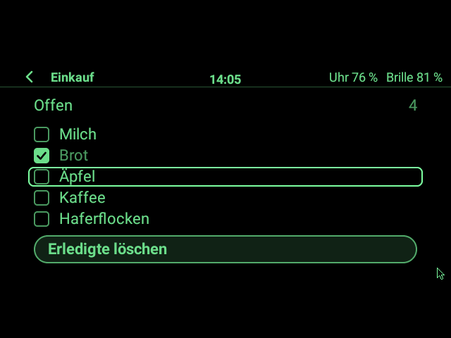
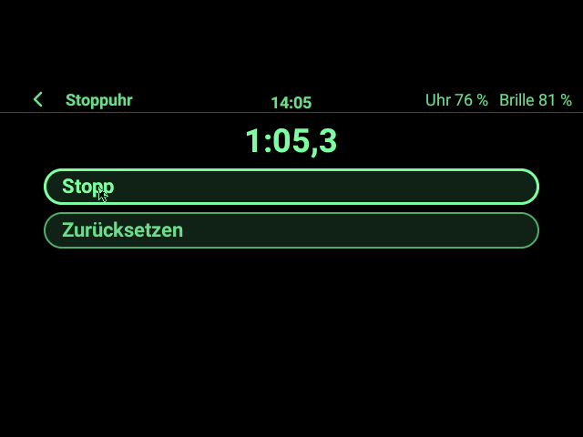

# G2 Watch – Firmware für die Even Realities G2 direkt von der Uhr

Eine eigenständige Wear-OS-App: Die Uhr lädt die Firmware, prüft sie und spielt sie über Bluetooth auf
die **Even Realities G2** – wahlweise die **Original-Firmware** von Even oder die **Custom-Firmware**
von Faceclaw. Ein Handy braucht es dafür nicht. Die Uhr-Oberfläche mit Touchpad, Maus-Zeiger und
Einstellungen stammt aus dem Uhr-Paket (`G2Watch_Uhr-UI_und_Maus`) und läuft auf der Brille, sobald
die Custom-Firmware drauf ist.


> **Ehrlicher Stand (v0.4.0):** Nichts davon ist auf echter Uhr und Brille erprobt. Alle Tests laufen
> gegen eine simulierte Brille, dazu das echte Custom-Image bitgenau durch den echten Flasher. Neu in
> 0.4.0: der **App-Host** – eigene Apps auf der Brille, mit Starter, App-Menü und zwei Beispiel-Apps
> ([Apps auf der Brille](#apps-auf-der-brille)).

## Was aufgespielt werden kann

| Knopf auf der Uhr | Image | Größe | SHA-256 |
|---|---|---|---|
| **Original-Firmware** | Evens Firmware 2.3.0.24, von Evens Server | 4.537.963 B | `187ccf2b…0979` |
| **Custom-Firmware** | **Faceclaw/35** = 2.3.0.24 + Patch-Set von g2flash, auf der Uhr gebaut | 4.609.823 B | `d7971b68…2817` |

Nur diese beiden Images sind erlaubt; die Werte stehen fest in
[`FirmwareCatalog.kt`](firmware-image/src/main/kotlin/ch/madtreasures/g2watch/firmware/FirmwareCatalog.kt).
Evens Firmware liegt **nie** im Repo und nie in der App: Die Uhr lädt sie von Evens Server (oder du
legst sie per `adb` ab) und prüft sie per SHA-256.

**Warum Revision 35 und nicht 34?** Die Übergabe-Pakete beschreiben Faceclaw/34. Revision 34 war aber
nur ein Zwischenstand von Faceclaw (wenige Stunden); das veröffentlichte **Faceclaw 0.8.0 verlangt
genau 35**, und g2flash baut heute 35. Revision 35 hat außerdem das Format der Zeichenbefehle geändert:
Ein Kern für 34 kann auf einer 35er-Brille nicht zeichnen und umgekehrt. Deshalb gehören Firmware und
der mitgelieferte Faceclaw-Kern (0.8.0) zusammen, und die App prüft die Revision **exakt**. So bleibt
die Brille auch mit der Faceclaw-Handy-App verwendbar, ohne hin und her zu flashen.

## Bedienung auf der Uhr

1. **Brille wählen.** App starten, Bluetooth erlauben, Brille aus dem Etui nehmen. Die Even-App auf
   dem Handy beenden oder am Handy Bluetooth ausschalten – die Brille nimmt nur eine Verbindung an.
2. **Prüfung.** Die Uhr liest nur die Firmware-Version. Mit Original-Firmware erscheint
   „Firmware passt nicht“ und darunter **Einstellungen**. (Mit Custom-Firmware geht es direkt zum
   Touchpad; die Einstellungen öffnen sich dort, wenn man das Zahnrad 0,9 s hält. Die Statusseite bietet
   die Einstellungen an, sobald keine Verbindung läuft.)
3. **Custom-Firmware** (oder **Original-Firmware**) antippen → Bestätigungsseite lesen →
   **„Zum Aufspielen 2 s halten“**.
4. **Auf der Brille bestätigen:** Die Brille zeigt selbst eine Frage – mit Bügel oder Ring zu
   **„Yes, flash“** wischen und tippen. „No, cancel“ bricht ab, ohne etwas zu verändern.
5. **Übertragung:** erst das linke Glas, dann startet die Brille kurz neu, dann das rechte. Bis etwa
   35 Minuten (etwa 17 pro Glas). Die Uhr bleibt an, die Seite hat keinen Zurück-Knopf. Uhr bei der Brille lassen,
   Brille nicht ins Etui legen.
6. **Kontrolle:** Nach dem Neustart fragt die Uhr jedes Glas einzeln und meldet z. B.
   „Beide Gläser melden Faceclaw/35“. Mit **OK** verbindet sie sich neu – mit Custom-Firmware startet
   dann das Touchpad mit dem Maus-Zeiger auf der Brille. Die Even-App auf dem Handy muss danach
   eventuell neu mit der Brille gekoppelt werden.

**Zurück zur Original-Firmware** geht auf demselben Weg (Einstellungen → *Original-Firmware*),
solange die Brille startet und sich verbinden lässt. Die Seite **Risiken & Rückweg** in den
Einstellungen fasst zusammen, was schiefgehen kann ([Recherche](docs/RECHERCHE_FIRMWARE.md)).

## Apps auf der Brille

Seit 0.4.0 hat die Uhr einen **App-Host** (Meilenstein M1 aus
[`docs/app-entwicklung`](docs/app-entwicklung/00_LIES_MICH.md)): Apps beschreiben ihre Oberfläche als
Seiten aus Bausteinen (wie im [G2 Baukasten](designer/README.md)), der Host zeichnet sie auf die Brille und
verteilt die Eingaben. Eingebaut sind zwei Beispiel-Apps: **Stoppuhr** und **Einkauf** (Einkaufsliste zum
Abhaken, Seite aus dem Baukasten).

| Starter | Einkauf (per Bügel abgehakt) | App-Menü |
|---|---|---|
|  |  |  |
| **Stoppuhr** | **Berechtigung beim ersten Start** | **Vollbild-Seite mit randlosem Bild** |
|  |  |  |
| **Alle Bausteine** | **… gescrollt, Fokus unten** | **Uhr im Gesten-Modus** |
|  |  |  |

**Bedienen:**

- Auf dem Desktop der Brille die Kachel **Apps** anklicken → der **Starter** listet alle Apps; laufende
  sind mit „läuft“ markiert.
- **Zeiger** (Finger auf der Uhr): Was unter dem Zeiger liegt, ist hervorgehoben; Doppeltipp auf der Uhr
  klickt es. Den Zeiger über den oberen oder unteren Rand hinaus schieben scrollt lange Seiten.
- **Bügel oder Ring:** Wischen springt zum nächsten/vorigen Knopf, Schalter oder Häkchen (die Seite scrollt
  mit), Tippen klickt ihn, Doppeltippen geht zurück.
- **Zurück** geht immer: Doppeltipp am Bügel, „‹“ in der Kopfzeile, „Zurück“ im App-Menü. Auf der ersten
  Seite schließt Zurück die App.
- **App-Menü:** am Bügel tippen und dann halten, oder den App-Namen in der Kopfzeile anklicken. Es zeigt die
  eigenen Einträge der App, dann „Apps“ (App läuft im Hintergrund weiter), „Zurück“ und „Schließen“.
- **Gesten-Modus:** Apps mit `input: "gestures"` (Spiele, später Even-Hub-Apps) bekommen rohe Gesten. Der
  Zeiger verschwindet, auf der Uhr steht „Gesten“: Wischen in vier Richtungen (nach rechts = zurück),
  Tippen, Doppeltippen, lang Drücken. Das Zahnrad öffnet weiter die Einstellungen.
- Braucht eine App Mikrofon, Standort o. Ä., fragt die Brille beim ersten Start einmal nach („Erlauben“ /
  „Ablehnen“). Sensoren, Mikrofon und Summer kommen erst mit M6 bei den Apps an.

Eine eigene Uhr-App ist eine kleine Kotlin-Klasse unter
[`app/src/main/java/ch/madtreasures/g2watch/apps/`](app/src/main/java/ch/madtreasures/g2watch/apps); wie das
geht, steht in [03 – Uhr-Apps](docs/app-entwicklung/03_Uhr-Apps.md). Apps berühren nie den Firmware-Pfad
(`AppsBoundaryTest`, `FlashingBoundaryTest`).

## Wie die Uhr aufspielt – und was sie absichert

Der eigentliche Flasher ist **Faceclaws** `OtaFlashFlow` (ein Port von `g2flash.py`) samt Vorprüfung
`FlashPromptFlow` – dieselben Abläufe, mit denen Faceclaws Handy-App die Firmware aufspielt, hier
unverändert mitgeliefert. Die Uhr-App ([`FirmwareJob.kt`](app/src/main/java/ch/madtreasures/g2watch/firmware/FirmwareJob.kt))
legt die Reihenfolge und die Schranken drumherum:

| Schritt | Was passiert | Bricht ab, wenn … | Brille berührt? |
|---|---|---|---|
| 1 | Beide Bügel bekannt, Akku der Uhr | Bügel fehlt; Uhr < 50 % und nicht am Laden | nein |
| 2 | Original laden (Cache → `adb`-Import → Evens Server), Custom bauen, **SHA-256 beider Enden**, vollständige Image-Prüfung inkl. Speichergrenze | Download scheitert, Hash falsch, Image fehlerhaft | nein |
| 3 | Die Brillenverbindung der App wird sauber getrennt | – | nein |
| 4 | Versionen lesen (nur lesend) | Brille meldet nichts; **neuere** Original-Firmware als 2.3.0.24 (ungetesteter Downgrade) | nur lesen |
| 5 | Beide Bügel koppeln, **Frage auf der Brille**, Lautlos-Modus erkennen, Akku beider Gläser | „No“, keine Antwort, Lautlos-Modus, Glas < 50 % **oder unlesbar** | Frage |
| 6 | Allow-List **direkt vor dem ersten Byte** erneut prüfen, Verbindung „scharf“ schalten, links → rechts übertragen | Fehler eines Glases → Stopp, **nie** automatisch von vorn | ja |
| 7 | Nach dem Neustart **jedes Glas einzeln** fragen | meldet rot, wenn nicht beide die neue Firmware zeigen | nur lesen |

Zusätzlich sitzt vor dem Update-Kanal ein Wächter
([`GuardedStockLink.kt`](app/src/main/java/ch/madtreasures/g2watch/firmware/GuardedStockLink.kt)): Er lässt
Firmware-Bytes nur durch, wenn Schritt 6 ihn scharf geschaltet hat, **und** nur bei einer
Bluetooth-MTU ≥ 243 (sonst passen die 240-Byte-Rahmen nicht; Faceclaw prüft das selbst nicht) – eine
zu schmale Verbindung wird schon beim Aufbau getrennt, sodass Faceclaws Wiederverbindung greift; bleibt
sie zu schmal, nennt die Meldung die ausgehandelte MTU, und nichts wurde geschrieben. Die
2 s zum Bestätigen misst die Uhr mit der Uhrzeit, nicht mit der Animation (sonst würde „Animationen
aus“ in den Entwickleroptionen aus dem Halten ein Tippen machen). Ein
Test ([`FlashingBoundaryTest`](app/src/test/java/ch/madtreasures/g2watch/firmware/FlashingBoundaryTest.kt))
schlägt fehl, sobald Code einen zweiten Weg zum Aufspielen öffnet. Während der Übertragung hält ein
Vordergrund-Dienst mit Wake-Lock die Uhr wach.

Jede Fehlermeldung sagt, in welchem Zustand die Brille ist: „Nichts wurde an der Brille verändert“,
„Das linke Glas hat die neue Firmware, das rechte nicht“ oder „Welche Firmware die Brille jetzt
startet, ist unklar …“ mit dem Weg zurück – auch wenn Android die App mitten in der Übertragung
beendet hat. Details: [`docs/FIRMWARE.md`](docs/FIRMWARE.md).

## App auf die Uhr bringen

**Ohne eigene Entwicklungsumgebung:** Jeder Push baut die App auf GitHub (Actions → *Build* →
Artefakt `g2watch-debug-apk`). Auf der Uhr *Entwickleroptionen → ADB-Debugging* und *Debugging über
WLAN* einschalten, dann am Rechner:

```sh
adb pair <ip>:<pairing-port>        # Code steht auf der Uhr
adb connect <ip>:<port>
adb install -r app-debug.apk
```

**Mit Android Studio** (Quail 4 | 2026.1.4 oder neuer; ältere Versionen kennen das Android-Gradle-Plugin 9.4
dieses Projekts noch nicht):

1. Projektordner öffnen (*File → Open*). Beim ersten Öffnen lädt Gradle alle Abhängigkeiten; fehlt die
   Android-Plattform API 37, bietet Android Studio die Installation an (sonst *Tools → SDK Manager*).
2. Uhr koppeln: Auf der Uhr die Entwickleroptionen freischalten (*Einstellungen → System → Info →
   Versionen*, 7× auf *Build-Nummer* tippen), dort *ADB-Debugging* und *Debugging über WLAN* einschalten.
   Uhr und Rechner im selben WLAN. In Android Studio in der Geräteauswahl *Pair Devices Using Wi-Fi →
   Pair using pairing code*; den Code zeigt die Uhr unter *Debugging über WLAN → Neues Gerät koppeln*.
3. Oben die Konfiguration **app** und die Uhr als Gerät wählen, **▶ Run**: Android Studio baut die App,
   installiert sie auf der Uhr und startet sie.

**Selbst bauen auf der Kommandozeile** (JDK 17 oder neuer, Android SDK mit Plattform 37):

```sh
./gradlew :app:assembleDebug        # → app/build/outputs/apk/debug/app-debug.apk
```

In Claude Code im Web richtet [.claude/hooks/session-start.sh](.claude/hooks/session-start.sh) das bei
jedem Chat-Start selbst ein: Android SDK, und für Maven Central einen lokalen Zwischenspeicher, der die
Absagen „429 Too Many Requests“ der geteilten Cloud-Rechner abfängt.

**Uhr ohne Internet:** Evens Image selbst laden und auf die Uhr legen; die App nimmt jede `.bin`-Datei
mit dem richtigen SHA-256 aus diesem Ordner:

```sh
curl -o g2_2.3.0.24.bin https://cdn.evenreal.co/firmware/1dbdf37b03a1169c384945e94d671371.bin
adb push g2_2.3.0.24.bin /sdcard/Android/data/ch.madtreasures.g2watch/files/firmware/
```

Vorausgesetzt ist Wear OS 4 (API 33) oder neuer. Ausgelegt ist die App auf die **Pixel Watch 5
(45 mm, LTE)** mit Wear OS 7 (Android 17, API 37, das Ziel-SDK der App); die Bilder in
[`docs/bilder`](docs/bilder) zeigen ihren runden 456-px-Bildschirm. Mit LTE lädt die Uhr Evens Firmware
(4,5 MB) auch ohne Handy und WLAN, und am Handy darf Bluetooth für das Aufspielen aus sein, ohne dass
die Uhr offline ist.

## Projektaufbau

| Modul | Inhalt |
|---|---|
| [`app/`](app) | Wear-OS-App: Uhr-Oberfläche, Maus, Einstellungen (aus dem Uhr-Paket), das Firmware-Paket `ch.madtreasures.g2watch.firmware` und der App-Host `ch.madtreasures.g2watch.apps` mit Starter und Beispiel-Apps |
| [`firmware-image/`](firmware-image) | Reines Kotlin ohne Android: EVENOTA-Prüfung mit Speichergrenze, Patch-Set von g2flash, Allow-List. Auf dem PC testbar |
| [`faceclaw-core/`](faceclaw-core), [`faceclaw-android/`](faceclaw-android) | Faceclaw **0.8.0**, unverändert übernommen ([Herkunft](faceclaw-core/UPSTREAM.md), [`scripts/sync-faceclaw.sh`](scripts/sync-faceclaw.sh)) |
| [`tools/cfw_bauen.py`](tools/cfw_bauen.py) | Baut und prüft Faceclaw/35 auf dem PC (Python, ohne Flashen) |
| [`designer/`](designer), [`designs/`](designs) | G2 Baukasten: Brillen-Seiten aus Bausteinen zusammenstellen (Web-App), und ein Beispiel |
| [`docs/app-entwicklung/`](docs/app-entwicklung/00_LIES_MICH.md) | **Spezifikation für Apps**: Uhr-Apps, Even-Hub-Apps auf der Uhr (GeckoView) oder dem Handy, Rechner-Apps, Umsetzungsplan und Texte für neue Chats |
| [`docs/`](docs) | [Firmware-Ablauf](docs/FIRMWARE.md), [Recherche mit Risiken](docs/RECHERCHE_FIRMWARE.md), [Übergabe-Paket Custom-Firmware](docs/firmware-uebergabe/00_LIES_MICH.md), [Uhr-Paket](docs/uhr-paket/LIESMICH.md), [Bilder](docs/bilder) |

## Testen

```sh
./gradlew :firmware-image:test :faceclaw-core:testAndroidHostTest :app:testDebugUnitTest
```

Stand dieses Commits: 15 + 184 + 291 Tests grün (28 Bild-Tests werden ohne `-PsnapshotDir`
übersprungen), Lint ohne Fehler. Die wichtigsten:

- **`FirmwareJobTest`** – der ganze Ablauf mit Faceclaws echten Abläufen gegen eine simulierte Brille:
  Aufspielen beider Ziele, jedes Abbruchkriterium (Ablehnen, Lautlos, Akku, MTU, neuere Firmware,
  fremdes Image, Download-Fehler) schreibt **kein** Byte in den Update-Kanal, Fehler während der
  Übertragung melden den richtigen Zustand.
- **Mit Evens echtem Image** (nicht im Repo, einmal laden):
  ```sh
  G2_STOCK_IMAGE=/pfad/zu/g2_2.3.0.24.bin ./gradlew :firmware-image:test :app:testDebugUnitTest
  ```
  `RealImageTest` baut Faceclaw/35 bitgenau nach; `RealImageTransferTest` schickt das komplette echte
  Image (≈ 1.130 Blöcke pro Glas) durch Faceclaws Flasher an die simulierte Brille und vergleicht, was
  ankommt.
- **`AppHostTest`** – der App-Host mit Test-Apps, simuliertem Desktop und virtueller Zeit: `start` vor
  `visible`, Zurück auf der ersten Seite schließt, Knopf-Ziele und `@back`, Schalter und Häkchen sofort, höchstens
  alle 200 ms zeichnen, Timer ruhen verdeckt ohne `background`, 2-s- und 10-s-Regel, 50/500-ms-Regel,
  Absturz einer App, Berechtigungsfrage, App-Menü mit „Apps“ und Starter, Fokus per Bügel, Zeiger,
  Gesten-Modus, abgelehnte Befehle im Protokoll, interne Sitzungen (Anschlüsse für Even-Hub-Apps).
- **`InputRouterTest`** (jede Zeile der Gesten-Tabelle, Ring-Doppel), **`AppJsonTest`**, **`PageStateTest`**,
  **`BaukastenProjectTest`**, Tests der Beispiel-Apps mit `FakeAppContext`, **`AppsBoundaryTest`** (Apps
  berühren weder Firmware noch Bluetooth).
- Bilder neu erzeugen (Uhr, Desktop und Apps auf der Brille): `./gradlew :app:testDebugUnitTest --tests '*SnapshotTest*' -PsnapshotDir=$PWD/docs/bilder`
