# G2 Watch – Firmware für die Even Realities G2 direkt von der Uhr

Eine eigenständige Wear-OS-App: Die Uhr lädt die Firmware, prüft sie und spielt sie über Bluetooth auf
die **Even Realities G2** – wahlweise die **Original-Firmware** von Even oder die **Custom-Firmware**
von Faceclaw. Ein Handy braucht es dafür nicht. Die Uhr-Oberfläche mit Touchpad, Maus-Zeiger und
Einstellungen stammt aus dem Uhr-Paket (`G2Watch_Uhr-UI_und_Maus`) und läuft auf der Brille, sobald
die Custom-Firmware drauf ist.

Die Uhr-App ist außerdem die **Hauptapp für Apps auf der Brille**: Apps wie **YouTube** werden als eigene
Pakete dazu installiert ([Eigene Apps installieren](#eigene-apps-installieren)). Dazu kommt die Vorarbeit für
einen **Web-Browser auf der Brille**: das Modul `web-raster`, das Web-Seiten ins Brillenbild wandelt und Text
immer lesbar hält, und die Test-APK **„Gecko-Test“**, die misst, ob die Browser-Engine GeckoView auf der Uhr
gut genug läuft.

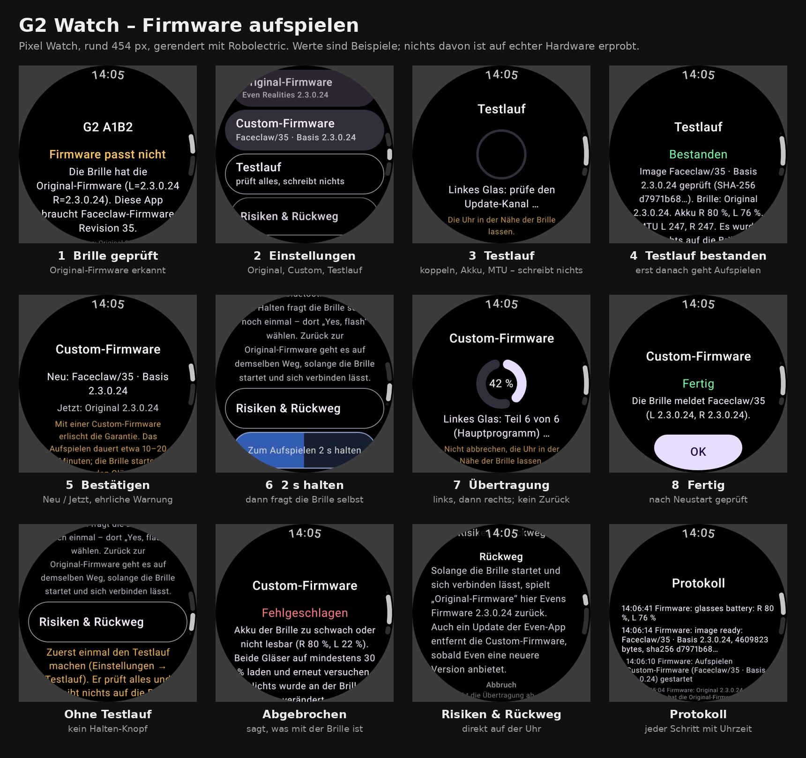

> **Ehrlicher Stand (v0.7.0):** Nichts davon ist auf echter Uhr und Brille erprobt. Alle Tests laufen
> gegen eine simulierte Brille, dazu das echte Custom-Image bitgenau durch den echten Flasher. Seit
> 0.4.0 gibt es den **App-Host** – eigene Apps auf der Brille, mit Starter und App-Menü
> ([Apps auf der Brille](#apps-auf-der-brille)). Seit 0.5.0 die App **YouTube** – Videos suchen und
> als Graustufen-Raster auf der Brille ansehen, alles auf der Uhr ([YouTube auf der Brille](#youtube-auf-der-brille)).
> Neu in 0.5.2: [Emoji](#emoji) erscheinen in allen Texten als Strichzeichnung statt als Kleckse.
> Neu in 0.6.0: **App-Pakete** – eigene Apps als Datei auf die Uhr legen und dort installieren, ohne die
> Uhr-App neu zu bauen ([Eigene Apps installieren](#eigene-apps-installieren)). Seit 0.7.0 ist auch YouTube
> ein solches Paket; die Uhr-App selbst bringt keine App mehr mit.
> Neu in 0.7.0: die **Vorarbeit für einen Browser** – Web-Seiten fürs Brillenbild und die Test-App
> „Gecko-Test“ (M2); der Browser selbst ist noch nicht gebaut ([Web-Seiten fürs Brillenbild](#web-seiten-fürs-brillenbild-vorarbeit-für-den-browser)).

## Was aufgespielt werden kann

| Knopf auf der Uhr | Image | Größe | SHA-256 |
|---|---|---|---|
| **Original-Firmware** | Evens Firmware 2.3.0.24, von Evens Server | 4.537.963 B | `187ccf2b…0979` |
| **Custom-Firmware** | **Faceclaw/35** = 2.3.0.24 + Patch-Set von g2flash, auf der Uhr gebaut | 4.609.823 B | `d7971b68…2817` |

Nur diese beiden Images sind erlaubt; die Werte stehen fest in
[`FirmwareCatalog.kt`](firmware-image/src/main/kotlin/ch/madtreasures/g2watch/firmware/FirmwareCatalog.kt).
Evens Firmware liegt **nie** im Repo und nie in der App: Die Uhr lädt sie von Evens Server (oder du
legst sie per `adb` ab) und prüft sie per SHA-256.

**Warum Revision 35 und nicht 34?** Die Übergabe-Pakete beschreiben Faceclaw/34. Revision 34 war aber
nur ein Zwischenstand von Faceclaw (wenige Stunden); das veröffentlichte **Faceclaw 0.8.0 verlangt
genau 35**, und g2flash baut heute 35. Revision 35 hat außerdem das Format der Zeichenbefehle geändert:
Ein Kern für 34 kann auf einer 35er-Brille nicht zeichnen und umgekehrt. Deshalb gehören Firmware und
der mitgelieferte Faceclaw-Kern (0.8.0) zusammen, und die App prüft die Revision **exakt**. So bleibt
die Brille auch mit der Faceclaw-Handy-App verwendbar, ohne hin und her zu flashen.

## Bedienung auf der Uhr

1. **Brille wählen.** App starten, Bluetooth erlauben, Brille aus dem Etui nehmen. Die Even-App auf
   dem Handy beenden oder am Handy Bluetooth ausschalten – die Brille nimmt nur eine Verbindung an.
2. **Prüfung.** Die Uhr liest nur die Firmware-Version. Mit Original-Firmware erscheint
   „Firmware passt nicht“ und darunter **Einstellungen**. (Mit Custom-Firmware geht es direkt zum
   Touchpad; die Einstellungen öffnen sich dort, wenn man das Zahnrad 0,9 s hält. Die Statusseite bietet
   die Einstellungen an, sobald keine Verbindung läuft.)
3. **Custom-Firmware** (oder **Original-Firmware**) antippen → Bestätigungsseite lesen →
   **„Zum Aufspielen 2 s halten“**.
4. **Auf der Brille bestätigen:** Die Brille zeigt selbst eine Frage – mit Bügel oder Ring zu
   **„Yes, flash“** wischen und tippen. „No, cancel“ bricht ab, ohne etwas zu verändern.
5. **Übertragung:** erst das linke Glas, dann startet die Brille kurz neu, dann das rechte. Bis etwa
   35 Minuten (etwa 17 pro Glas). Die Uhr bleibt an, die Seite hat keinen Zurück-Knopf. Uhr bei der Brille lassen,
   Brille nicht ins Etui legen.
6. **Kontrolle:** Nach dem Neustart fragt die Uhr jedes Glas einzeln und meldet z. B.
   „Beide Gläser melden Faceclaw/35“. Mit **OK** verbindet sie sich neu – mit Custom-Firmware startet
   dann das Touchpad mit dem Maus-Zeiger auf der Brille. Die Even-App auf dem Handy muss danach
   eventuell neu mit der Brille gekoppelt werden.

**Zurück zur Original-Firmware** geht auf demselben Weg (Einstellungen → *Original-Firmware*),
solange die Brille startet und sich verbinden lässt. Die Seite **Risiken & Rückweg** in den
Einstellungen fasst zusammen, was schiefgehen kann ([Recherche](docs/RECHERCHE_FIRMWARE.md)).

## Apps auf der Brille

Seit 0.4.0 hat die Uhr einen **App-Host** (Meilenstein M1 aus
[`docs/app-entwicklung`](docs/app-entwicklung/00_LIES_MICH.md)): Apps beschreiben ihre Oberfläche als
Seiten aus Bausteinen (wie im [G2 Baukasten](designer/README.md)), der Host zeichnet sie auf die Brille und
verteilt die Eingaben. Jede App ist ein App-Paket, zurzeit **YouTube** ([YouTube auf der Brille](#youtube-auf-der-brille)).
Im Starter steht eine App, sobald man sie installiert hat ([Eigene Apps installieren](#eigene-apps-installieren)).

| Starter | App-Menü | Berechtigung beim ersten Start |
|---|---|---|
| 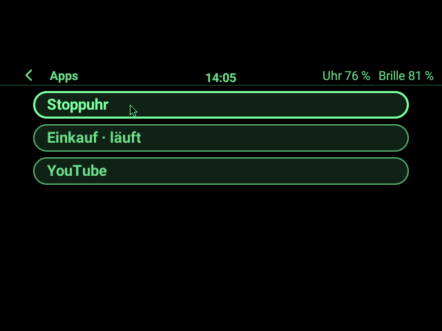 | 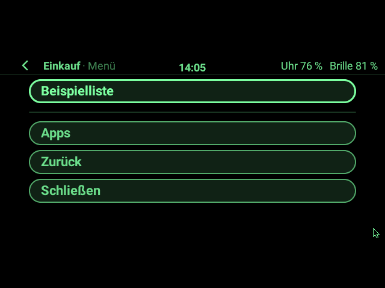 | 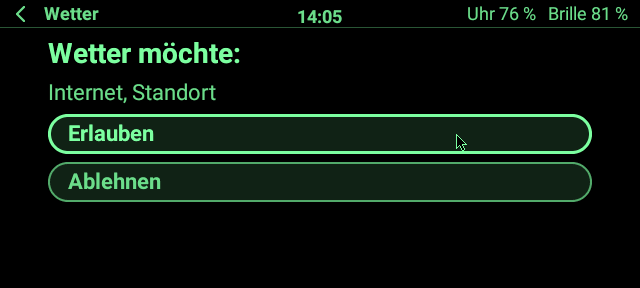 |
| **Vollbild-Seite mit randlosem Bild** | | |
|  | | |
| **Alle Bausteine** | **… gescrollt, Fokus unten** | **Uhr im Gesten-Modus** |
| 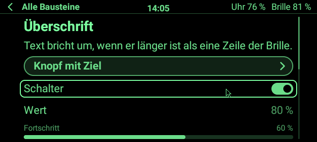 | 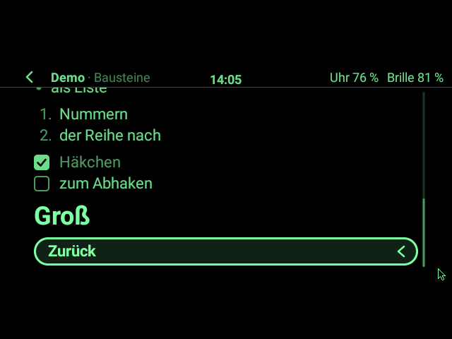 | 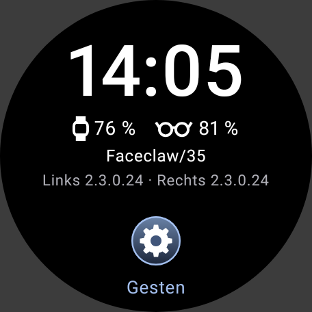 |

**Bedienen:**

- Auf dem Desktop der Brille die Kachel **Apps** anklicken → der **Starter** listet alle Apps; laufende
  sind mit „läuft“ markiert. Ohne Apps steht dort „Noch keine Apps“.
- **Zeiger** (Finger auf der Uhr): Was unter dem Zeiger liegt, ist hervorgehoben; Doppeltipp auf der Uhr
  klickt es. Den Zeiger über den oberen oder unteren Rand hinaus schieben scrollt lange Seiten.
- **Bügel oder Ring:** Wischen springt zum nächsten/vorigen Knopf, Schalter oder Häkchen (die Seite scrollt
  mit), Tippen klickt ihn, Doppeltippen geht zurück.
- **Zurück** geht immer: Doppeltipp am Bügel, „‹“ in der Kopfzeile, „Zurück“ im App-Menü. Auf der ersten
  Seite schließt Zurück die App.
- **App-Menü:** am Bügel tippen und dann halten, oder den App-Namen in der Kopfzeile anklicken. Es zeigt die
  eigenen Einträge der App, dann „Apps“ (App läuft im Hintergrund weiter), „Zurück“ und „Schließen“.
- **Gesten-Modus:** Apps mit `input: "gestures"` (Spiele, später Even-Hub-Apps) bekommen rohe Gesten, seit
  0.5.0 auch einzelne Seiten (etwa das Video der YouTube-App). Der Zeiger verschwindet, auf der Uhr steht
  „Gesten“: Wischen in vier Richtungen (nach rechts = zurück), Tippen, Doppeltippen, lang Drücken. Das
  Zahnrad öffnet weiter die Einstellungen.
- **Texteingabe:** Fragt eine App nach Text (etwa die Suche), öffnet die Uhr ihre Tastatur mit
  Spracheingabe; auf der Brille steht „Bitte auf der Uhr eingeben“.
- Braucht eine App Mikrofon, Standort o. Ä., fragt die Brille beim ersten Start einmal nach („Erlauben“ /
  „Ablehnen“). Sensoren, Mikrofon und Summer kommen erst mit M6 bei den Apps an.

Eine eigene Uhr-App ist eine kleine Kotlin-Klasse in einem eigenen Ordner unter [`packages/`](packages)
und kommt als App-Paket auf die Uhr (nächster Abschnitt); wie man sie schreibt, steht in
[03 – Uhr-Apps](docs/app-entwicklung/03_Uhr-Apps.md). Apps berühren nie den Firmware-Pfad
(`AppsBoundaryTest`, `FlashingBoundaryTest`).

### Emoji

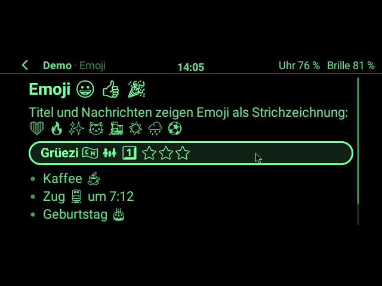

Die Uhr zeichnet jeden Text selbst als Pixel. Androids Emoji sind Farbbilder, und davon blieb in den
16 Grünstufen der Brille nur der Umriss – ein gefüllter Klecks. Seit 0.5.2 bringt die App deshalb eine
Schwarz-Weiß-Emoji-Schrift mit: [Noto Emoji](https://fonts.google.com/noto/specimen/Noto+Emoji) von Google
(SIL Open Font License 1.1; mit Lizenztext in `app/src/main/assets/fonts/`; die APK wird 1,3 MB größer, geladen
belegt die Schrift 2 MB Speicher).
Emoji erscheinen damit in allen Apps als Strichzeichnung – in Video-Titeln, Knöpfen, Listen und Meldungen –,
fett in Überschriften. Flaggen werden zu Kästchen mit Länderkürzel, Hautfarben sind nicht zu sehen, farbige
Herzen sind schraffiert. „…“ und Zeilenumbruch schneiden nie ein Emoji entzwei. Emoji ab Unicode 16 (2024)
kennt die Schrift noch nicht; sie bleiben Kleckse. Details: [03 §11](docs/app-entwicklung/03_Uhr-Apps.md#11-emoji-v052).

## Eigene Apps installieren

Seit 0.6.0 ist jede eigene App ein **App-Paket**: eine Datei `<app-id>-<version>.g2app` (eine ZIP-Datei).
Die Uhr-App installierst du einmal (unten, [App auf die Uhr bringen](#app-auf-die-uhr-bringen)); Apps
kommen danach einzeln dazu, ändern und entfernen sich ohne neue Uhr-App. Alles Weitere, auch wie ein
Paket gebaut wird: [09 – App-Pakete](docs/app-entwicklung/09_App-Pakete.md).

| Seite „Apps“ auf der Uhr |
|---|
| 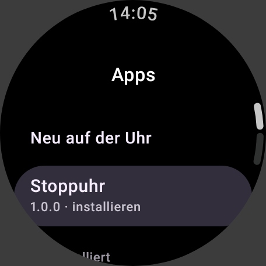 |

1. **Paket-Datei holen:** vom App-Chat, aus GitHub (Actions → *Build* → Artefakt `g2-apps`, enthält alle
   Pakete aus `packages/`) oder selbst bauen: `./gradlew :packages:youtube:g2app`.
2. **Auf die Uhr legen** (Uhr mit Android Studio verbunden, wie beim Installieren der Uhr-App): *View →
   Tool Windows → Device Explorer* → Uhr → `sdcard/Android/data/ch.madtreasures.g2watch/files/apps/` →
   Rechtsklick → *Upload*. Oder:
   ```sh
   adb push ch.madtreasures.youtube-1.0.0.g2app /sdcard/Android/data/ch.madtreasures.g2watch/files/apps/
   ```
3. **Installieren:** auf der Uhr Zahnrad halten → *Einstellungen → Apps installieren* → unter „Neu auf der
   Uhr“ die App antippen. Sie steht sofort im Starter der Brille.

Eine neuere Version installiert man genauso (die laufende alte endet). **Entfernen:** unter „Installiert“
zweimal antippen. Fertiges Paket: **YouTube**.

## YouTube auf der Brille

Die App **YouTube** (seit 0.5.0, seit 0.7.0 als App-Paket `ch.madtreasures.youtube-1.0.0.g2app`, zu
installieren wie in [Eigene Apps installieren](#eigene-apps-installieren)) läuft **ganz auf der Uhr**, ohne
Handy und ohne Rechner: Sie sucht auf
YouTube, lädt das Video über WLAN oder LTE, dekodiert es und rechnet jedes Bild in das Raster der Brille
um – Graustufen in Grün, wie bei „G2 Agent Cam“ im Even Hub, nur mit Videos. Wie das gebaut ist, steht in
[03 §10](docs/app-entwicklung/03_Uhr-Apps.md#10-video-auf-der-brille-v050).

| Start | Treffer (Suche per Tastatur/Sprache der Uhr) | Video |
|---|---|---|
| 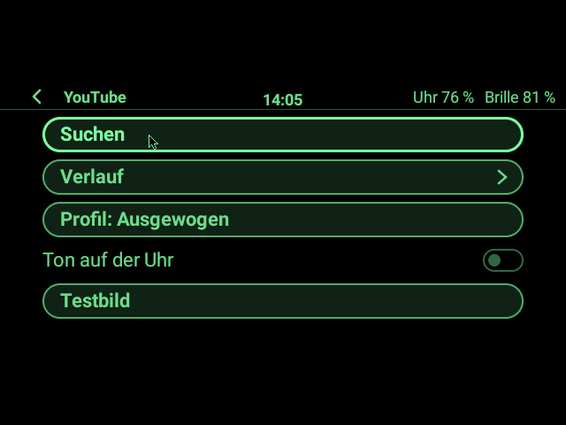 | 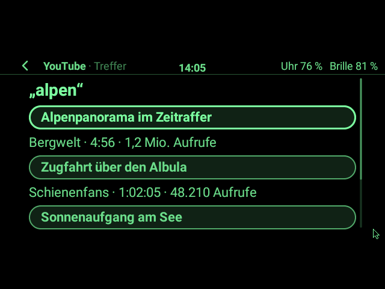 | 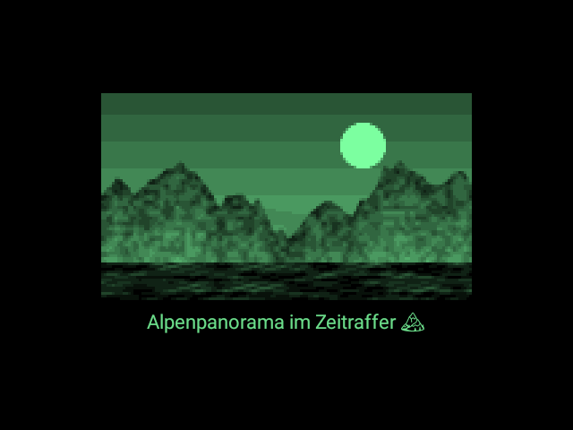 |
| **Pause** | **Testbild der Uhr** (ohne Internet) | **Profile Stabil / Ausgewogen / Schnell** |
| 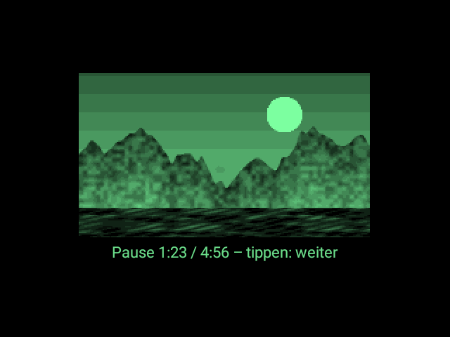 | 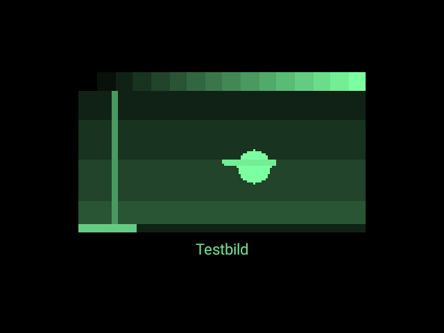 | 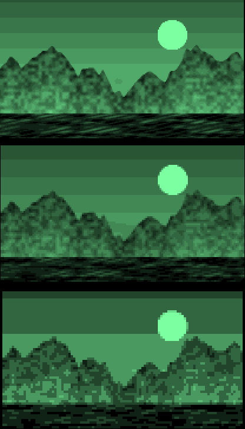 |

Die Videobilder oben sind ein erfundenes Landschafts-Video (keine echten YouTube-Inhalte im Repo), durch
dieselbe Umrechnung wie auf der Uhr.

**Bedienen:**

- **Suchen** anklicken → auf der Uhr erscheint die Tastatur (mit Spracheingabe und den letzten Suchen als
  Vorschlag). Die Treffer zeigen Titel, Kanal, Länge und Aufrufe; der erste ist schon ausgewählt, ein Tipp
  am Bügel spielt ihn ab.
- **Im Video** (Vollbild, Gesten-Modus): **Tippen** = Pause/weiter, **Wischen** = 10 s zurück/vor,
  **Doppeltippen** = zurück zur Liste, **lange drücken** = nächstes Profil. Auf der Uhr gilt dasselbe
  (Wischen hoch/runter, nach links = Profil, nach rechts = zurück). Unter dem Bild steht der Titel, bei
  Pause die Zeit.
- **Profil** (Startseite oder App-Menü) – wie bei „G2 Agent Cam“:

  | Profil | Bilder pro Sekunde | Raster (Punkte) | Graustufen | Bluetooth, Szene mit viel Detail / normal (simuliert) |
  |---|---|---|---|---|
  | **Stabil** | 1 | 208 × 117 | 16 | ≈ 12,5 KB/s / ≈ 3,3 KB/s |
  | **Ausgewogen** (Standard) | 2 | 138 × 78 | 16 | ≈ 11,8 KB/s / ≈ 3,6 KB/s |
  | **Schnell** | 4 | 104 × 58 | 8 | ≈ 10,9 KB/s / ≈ 3,3 KB/s |

  Die Brille bekommt etwa 41 KB/s; jedes Profil braucht also höchstens rund ein Drittel davon. Die Werte
  hat `VideoBudgetTest` mit Faceclaws eigener Übertragungs-Kodierung ausgerechnet, **nicht gemessen**.
  Kommt die Brille nicht nach, zeigt sie einfach das jeweils neueste Bild (nichts staut sich).
- **Ton auf der Uhr** (Schalter): spielt den Ton über den Lautsprecher der Uhr oder daran gekoppelte
  Kopfhörer. Die Brille selbst hat keinen Lautsprecher.
- **Verlauf:** die letzten 20 Videos, bleiben auf der Uhr gespeichert. **Testbild:** ein eigenes
  Ein-Minuten-Video der Uhr (Graustufen-Treppe, Ball, Zeiger) – zeigt ohne Internet, wie flüssig die Bilder
  ankommen.
- Verdeckt eine andere App das Video oder ist die Brille weg, hält es an und läuft danach weiter.

**Gut zu wissen:**

- Für die Videos fragt die Uhr Wear OS nach **WLAN oder LTE** statt der Bluetooth-Verbindung übers Handy
  (die teilt sich den Funk mit der Brille). Klappt das nicht innerhalb von 8 s, geht es über das Netz, das da
  ist. Ist das Video zu Ende oder 20 s pausiert, gibt die Uhr WLAN/LTE wieder frei. Die Uhr lädt die kleinste Fassung, die für das Raster reicht (meist 144p H.264, ≈ 130 kbit/s, also
  rund 60 MB pro Stunde; mit Ton etwa 20 MB mehr).
- **Akku:** Dekodieren, Funk und Bluetooth zur Brille kosten spürbar Akku der Uhr (465 mAh) – nicht gemessen.
- Die App wird dadurch rund **11 MB** größer (Debug-APK 41 statt 31 MB): NewPipeExtractor mit Rhino und
  Media3.
- YouTube-Zugriff über [NewPipeExtractor](https://github.com/TeamNewPipe/NewPipeExtractor) (GPL-3.0, wie der
  Faceclaw-Kern in dieser App) statt Googles App oder API. **YouTubes Nutzungsbedingungen untersagen den
  Abruf an YouTubes eigenen Apps und Schnittstellen vorbei**; die App ist für den privaten Gebrauch gedacht,
  auf eigenes Risiko. YouTube ändert seine Seiten öfter – dann hilft ein Update von NewPipeExtractor
  (Version in `gradle/libs.versions.toml`).
- Suche und Auflösen der Video-Adressen sind hier mit echtem Netz geprüft; **das Abspielen eines
  YouTube-Videos nicht** (YouTube bindet die Video-Adresse an die IP, und die Testumgebung ruft YouTube und
  die Videoserver über verschiedene Adressen auf). Auf der Uhr ist es dieselbe Adresse – das ist das Erste,
  was auf echter Hardware zu prüfen ist.

## Web-Seiten fürs Brillenbild (Vorarbeit für den Browser)

Das Modul [`web-raster/`](web-raster) wandelt eine gezeichnete Web-Seite in das Bild der Brille, so wie die
Even-Apps „Photos“ und „G2 Agent Cam“ Inhalte zeigen: Der Grund der Seite wird durchsichtig (egal ob weiß
oder dunkel), Fotos bleiben Bilder, Logos und Symbole werden gegen den Grund um sie herum gerechnet, und
**Text wird immer in voller Helligkeit neu gezeichnet**. Steht Text auf einem Foto oder unruhigem Grund, oder
leuchtet um ihn etwas in einem mit Bildern **überladenen** Fenster, wird er **negativ, nur an der Schrift**:
dunkle Buchstaben mit einem schmalen hellen Umriss, das Bild bleibt rundherum sichtbar. Wählbar sind auch
„Leuchtschrift mit Rand“ und die helle Platte hinter der ganzen Zeile.

| Heller Artikel | Dunkle Seite | Text auf Foto (Umriss) | Überladen: Text auf Bildern negativ, daneben hell |
|---|---|---|---|
| 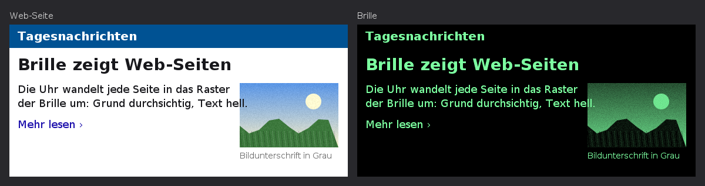 | 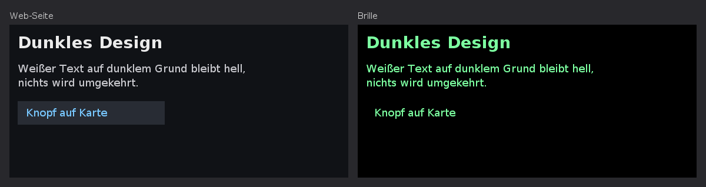 | 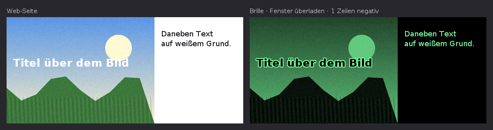 | 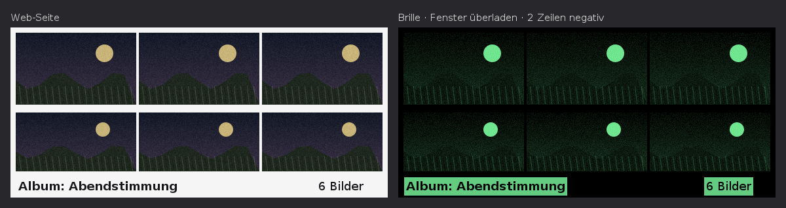 |

Links jeweils die Test-Seite, rechts das Brillenbild. Wie echte Seiten aussehen, zeigt die
[Seiten-Vorschau](tools/page-preview/README.md) (Chromium statt GeckoView). Die Regeln und Grenzwerte stehen in
[05 §10.1](docs/app-entwicklung/05_EvenHub-Apps.md#101-seiten-ins-brillen-raster-wandeln-web-raster-gebaut).
Der Browser selbst (Meilenstein M7) kommt, wenn der Gecko-Test zeigt, dass GeckoView auf der Uhr taugt.

## Gecko-Test (M2) auf die Uhr bringen und messen

Wear OS hat keinen Browser-Kern. Ob Mozillas **GeckoView** auf der Uhr schnell, sparsam und stabil genug
ist, kann nur die echte Uhr zeigen. Dafür gibt es die eigene kleine App **„Gecko-Test“**
([`tools/gecko-probe/`](tools/gecko-probe), [05 §5.2](docs/app-entwicklung/05_EvenHub-Apps.md#52-die-test-apk-gecko-test)).
Sie ist getrennt von G2 Watch, damit die Uhr-App nicht um ≈ 120 MB wächst, solange nichts entschieden ist.

1. **Architektur der Uhr:** Die Pixel Watch 5 läuft mit **32-Bit-Apps** (`armeabi-v7a`; Android Studio meldet
   „Device supports armeabi-v7a, armeabi“). Also Variante **armv7Release**. Bei einer anderen Uhr prüfen mit
   `adb shell getprop ro.product.cpu.abilist` (beginnt die Antwort mit `arm64-v8a` → **arm64Release**).
2. **Android Studio:** *Build → Select Build Variant…*, beim Modul **gecko-probe** die Variante aus Schritt 1
   wählen (Standard ist armv7). Meldet Android Studio „APK only supports arm64-v8a“, ist noch die
   arm64-Variante gewählt: *Cancel* und dort auf **armv7Release** umstellen. Oben die Konfiguration **gecko-probe** und die Uhr wählen, **▶ Run**. Das erste Mal lädt Gradle
   GeckoView (≈ 90 MB). GeckoView verlangt die Android-Plattform **API 37.1**; fehlt sie, bietet Android
   Studio die Installation an (sonst *Tools → SDK Manager → SDK Platforms*, *Show Package Details*, API 37.1
   ankreuzen). Die APK ist ≈ 120 MB groß; über WLAN dauert das Installieren ein paar Minuten.
   Ohne Android Studio: Artefakt `g2-gecko-test-apks` aus GitHub Actions laden und
   `adb install -r gecko-probe-armv7-release.apk` (bzw. `-arm64-`).
3. **Auf der Uhr** „Gecko-Test“ öffnen, die Mitteilungen erlauben, und die Tests der Reihe nach starten:
   **1 · Schnelltest** (≈ 1 min) → **2 · Timer-Test** (4 min; nach der Vibration das Handgelenk senken, bis
   es wieder vibriert) → **3 · Dauertest** (30 min Uhr normal tragen, nicht laden) → **4 · Seite rendern** →
   **5 · Wikipedia rendern** (braucht Internet). Den **Schnelltest als Erstes nach dem Öffnen** der App
   laufen lassen, sonst gibt es keinen Kaltstart-Wert.
4. Ganz nach unten scrollen, **Bericht** antippen (Knopf am unteren Rand) und am Rechner holen:
   ```sh
   adb pull /sdcard/Android/data/ch.madtreasures.g2watch.geckoprobe/files/ .
   ```
   Darin `g2-gecko-bericht.txt` (alle Werte mit ✓/~/✗ und einer Empfehlung) sowie `render-seite.png`,
   `render-ohne-schrift.png` und `render-brille.png`. Den Bericht in den nächsten Chat geben oder in
   [`quellen/E-m2-messwerte.md`](docs/app-entwicklung/quellen/E-m2-messwerte.md) eintragen.

## Wie die Uhr aufspielt – und was sie absichert

Der eigentliche Flasher ist **Faceclaws** `OtaFlashFlow` (ein Port von `g2flash.py`) samt Vorprüfung
`FlashPromptFlow` – dieselben Abläufe, mit denen Faceclaws Handy-App die Firmware aufspielt, hier
unverändert mitgeliefert. Die Uhr-App ([`FirmwareJob.kt`](app/src/main/java/ch/madtreasures/g2watch/firmware/FirmwareJob.kt))
legt die Reihenfolge und die Schranken drumherum:

| Schritt | Was passiert | Bricht ab, wenn … | Brille berührt? |
|---|---|---|---|
| 1 | Beide Bügel bekannt, Akku der Uhr | Bügel fehlt; Uhr < 50 % und nicht am Laden | nein |
| 2 | Original laden (Cache → `adb`-Import → Evens Server), Custom bauen, **SHA-256 beider Enden**, vollständige Image-Prüfung inkl. Speichergrenze | Download scheitert, Hash falsch, Image fehlerhaft | nein |
| 3 | Die Brillenverbindung der App wird sauber getrennt | – | nein |
| 4 | Versionen lesen (nur lesend) | Brille meldet nichts; **neuere** Original-Firmware als 2.3.0.24 (ungetesteter Downgrade) | nur lesen |
| 5 | Beide Bügel koppeln, **Frage auf der Brille**, Lautlos-Modus erkennen, Akku beider Gläser | „No“, keine Antwort, Lautlos-Modus, Glas < 50 % **oder unlesbar** | Frage |
| 6 | Allow-List **direkt vor dem ersten Byte** erneut prüfen, Verbindung „scharf“ schalten, links → rechts übertragen | Fehler eines Glases → Stopp, **nie** automatisch von vorn | ja |
| 7 | Nach dem Neustart **jedes Glas einzeln** fragen | meldet rot, wenn nicht beide die neue Firmware zeigen | nur lesen |

Zusätzlich sitzt vor dem Update-Kanal ein Wächter
([`GuardedStockLink.kt`](app/src/main/java/ch/madtreasures/g2watch/firmware/GuardedStockLink.kt)): Er lässt
Firmware-Bytes nur durch, wenn Schritt 6 ihn scharf geschaltet hat, **und** nur bei einer
Bluetooth-MTU ≥ 243 (sonst passen die 240-Byte-Rahmen nicht; Faceclaw prüft das selbst nicht) – eine
zu schmale Verbindung wird schon beim Aufbau getrennt, sodass Faceclaws Wiederverbindung greift; bleibt
sie zu schmal, nennt die Meldung die ausgehandelte MTU, und nichts wurde geschrieben. Die
2 s zum Bestätigen misst die Uhr mit der Uhrzeit, nicht mit der Animation (sonst würde „Animationen
aus“ in den Entwickleroptionen aus dem Halten ein Tippen machen). Ein
Test ([`FlashingBoundaryTest`](app/src/test/java/ch/madtreasures/g2watch/firmware/FlashingBoundaryTest.kt))
schlägt fehl, sobald Code einen zweiten Weg zum Aufspielen öffnet. Während der Übertragung hält ein
Vordergrund-Dienst mit Wake-Lock die Uhr wach.

Jede Fehlermeldung sagt, in welchem Zustand die Brille ist: „Nichts wurde an der Brille verändert“,
„Das linke Glas hat die neue Firmware, das rechte nicht“ oder „Welche Firmware die Brille jetzt
startet, ist unklar …“ mit dem Weg zurück – auch wenn Android die App mitten in der Übertragung
beendet hat. Details: [`docs/FIRMWARE.md`](docs/FIRMWARE.md).

## App auf die Uhr bringen

**Ohne eigene Entwicklungsumgebung:** Jeder Push baut die App auf GitHub (Actions → *Build* →
Artefakt `g2watch-debug-apk`). Auf der Uhr *Entwickleroptionen → ADB-Debugging* und *Debugging über
WLAN* einschalten, dann am Rechner:

```sh
adb pair <ip>:<pairing-port>        # Code steht auf der Uhr
adb connect <ip>:<port>
adb install -r app-debug.apk
```

**Mit Android Studio** (Quail 4 | 2026.1.4 oder neuer; ältere Versionen kennen das Android-Gradle-Plugin 9.4
dieses Projekts noch nicht):

1. Projektordner öffnen (*File → Open*). Beim ersten Öffnen lädt Gradle alle Abhängigkeiten; fehlt die
   Android-Plattform API 37, bietet Android Studio die Installation an (sonst *Tools → SDK Manager*).
2. Uhr koppeln: Auf der Uhr die Entwickleroptionen freischalten (*Einstellungen → System → Info →
   Versionen*, 7× auf *Build-Nummer* tippen), dort *ADB-Debugging* und *Debugging über WLAN* einschalten.
   Uhr und Rechner im selben WLAN. In Android Studio in der Geräteauswahl *Pair Devices Using Wi-Fi →
   Pair using pairing code*; den Code zeigt die Uhr unter *Debugging über WLAN → Neues Gerät koppeln*.
3. Oben die Konfiguration **app** und die Uhr als Gerät wählen, **▶ Run**: Android Studio baut die App,
   installiert sie auf der Uhr und startet sie.

**Selbst bauen auf der Kommandozeile** (JDK 17 oder neuer, Android SDK mit Plattform 37; für den Gecko-Test
zusätzlich 37.1):

```sh
./gradlew :app:assembleDebug                 # → app/build/outputs/apk/debug/app-debug.apk
./gradlew :gecko-probe:assembleArmv7Release  # → tools/gecko-probe/build/outputs/apk/armv7/release/
```

In Claude Code im Web richtet [.claude/hooks/session-start.sh](.claude/hooks/session-start.sh) das bei
jedem Chat-Start selbst ein: Android SDK, und für Maven Central einen lokalen Zwischenspeicher, der die
Absagen „429 Too Many Requests“ der geteilten Cloud-Rechner abfängt.

**Uhr ohne Internet:** Evens Image selbst laden und auf die Uhr legen; die App nimmt jede `.bin`-Datei
mit dem richtigen SHA-256 aus diesem Ordner:

```sh
curl -o g2_2.3.0.24.bin https://cdn.evenreal.co/firmware/1dbdf37b03a1169c384945e94d671371.bin
adb push g2_2.3.0.24.bin /sdcard/Android/data/ch.madtreasures.g2watch/files/firmware/
```

Vorausgesetzt ist Wear OS 4 (API 33) oder neuer. Ausgelegt ist die App auf die **Pixel Watch 5
(45 mm, LTE)** mit Wear OS 7 (Android 17, API 37, das Ziel-SDK der App); die Bilder in
[`docs/bilder`](docs/bilder) zeigen ihren runden 456-px-Bildschirm. Mit LTE lädt die Uhr Evens Firmware
(4,5 MB) auch ohne Handy und WLAN, und am Handy darf Bluetooth für das Aufspielen aus sein, ohne dass
die Uhr offline ist.

## Projektaufbau

| Modul | Inhalt |
|---|---|
| [`app/`](app) | Wear-OS-App: Uhr-Oberfläche, Maus, Einstellungen (aus dem Uhr-Paket), das Firmware-Paket `ch.madtreasures.g2watch.firmware`, der App-Host `ch.madtreasures.g2watch.apps` mit Starter, der fest eingebauten App YouTube, der Video-Wiedergabe `apps/video` und der Installation von App-Paketen `apps/packages` |
| [`app-api/`](app-api) | Die Schnittstelle der Apps (`G2App`, `AppContext`, Ereignisse, Seiten), reines Kotlin; App-Pakete werden dagegen gebaut ([09](docs/app-entwicklung/09_App-Pakete.md)) |
| [`packages/`](packages) | Ein Ordner je App-Paket, zurzeit [`youtube`](packages/youtube). `./gradlew :packages:<name>:g2app` baut die `.g2app`-Datei |
| [`firmware-image/`](firmware-image) | Reines Kotlin ohne Android: EVENOTA-Prüfung mit Speichergrenze, Patch-Set von g2flash, Allow-List. Auf dem PC testbar |
| [`faceclaw-core/`](faceclaw-core), [`faceclaw-android/`](faceclaw-android) | Faceclaw **0.8.0**, unverändert übernommen ([Herkunft](faceclaw-core/UPSTREAM.md), [`scripts/sync-faceclaw.sh`](scripts/sync-faceclaw.sh)) |
| [`web-raster/`](web-raster) | Reines Kotlin ohne Android: gezeichnete Web-Seite → Brillenbild mit lesbarem, bei Bedarf negativem Text (Vorarbeit für den Browser, M7) |
| [`tools/gecko-probe/`](tools/gecko-probe) | Test-APK „Gecko-Test“ (M2): misst GeckoView auf der Uhr; eigene App, nicht Teil von G2 Watch |
| [`tools/page-preview/`](tools/page-preview/README.md) | Seiten-Vorschau: echte Web-Seiten in Chromium im Brillenfenster öffnen und daneben das Brillenbild zeigen (zum Prüfen von `web-raster`) |
| [`tools/cfw_bauen.py`](tools/cfw_bauen.py) | Baut und prüft Faceclaw/35 auf dem PC (Python, ohne Flashen) |
| [`designer/`](designer), [`designs/`](designs) | G2 Baukasten: Brillen-Seiten aus Bausteinen zusammenstellen (Web-App), und ein Beispiel |
| [`docs/app-entwicklung/`](docs/app-entwicklung/00_LIES_MICH.md) | **Spezifikation für Apps**: Uhr-Apps, Even-Hub-Apps auf der Uhr (GeckoView) oder dem Handy, Rechner-Apps, Umsetzungsplan und Texte für neue Chats |
| [`docs/`](docs) | [Firmware-Ablauf](docs/FIRMWARE.md), [Recherche mit Risiken](docs/RECHERCHE_FIRMWARE.md), [Übergabe-Paket Custom-Firmware](docs/firmware-uebergabe/00_LIES_MICH.md), [Uhr-Paket](docs/uhr-paket/LIESMICH.md), [Bilder](docs/bilder) |

## Testen

```sh
./gradlew :firmware-image:test :faceclaw-core:testAndroidHostTest :web-raster:test :app-api:test :app:testDebugUnitTest
./gradlew :gecko-probe:testArmv7DebugUnitTest
```

Stand dieses Commits: 15 + 184 + 27 + 4 + 374 Tests grün, dazu 30 im Gecko-Test (Bild-Tests werden ohne `-PsnapshotDir` übersprungen,
die Tests mit Evens echtem Image ohne `G2_STOCK_IMAGE`, der Vorschau-Test des Gecko-Tests ohne `PREVIEW_DIR`),
Lint ohne Fehler. Die wichtigsten:

- **`FirmwareJobTest`** – der ganze Ablauf mit Faceclaws echten Abläufen gegen eine simulierte Brille:
  Aufspielen beider Ziele, jedes Abbruchkriterium (Ablehnen, Lautlos, Akku, MTU, neuere Firmware,
  fremdes Image, Download-Fehler) schreibt **kein** Byte in den Update-Kanal, Fehler während der
  Übertragung melden den richtigen Zustand.
- **Mit Evens echtem Image** (nicht im Repo, einmal laden):
  ```sh
  G2_STOCK_IMAGE=/pfad/zu/g2_2.3.0.24.bin ./gradlew :firmware-image:test :app:testDebugUnitTest
  ```
  `RealImageTest` baut Faceclaw/35 bitgenau nach; `RealImageTransferTest` schickt das komplette echte
  Image (≈ 1.130 Blöcke pro Glas) durch Faceclaws Flasher an die simulierte Brille und vergleicht, was
  ankommt.
- **`AppHostTest`** – der App-Host mit Test-Apps, simuliertem Desktop und virtueller Zeit: `start` vor
  `visible`, Zurück auf der ersten Seite schließt, Knopf-Ziele und `@back`, Schalter und Häkchen sofort, höchstens
  alle 200 ms zeichnen, Timer ruhen verdeckt ohne `background`, 2-s- und 10-s-Regel, 50/500-ms-Regel,
  Absturz einer App, Berechtigungsfrage, App-Menü mit „Apps“ und Starter, Fokus per Bügel, Zeiger,
  Gesten-Modus, abgelehnte Befehle im Protokoll, interne Sitzungen (Anschlüsse für Even-Hub-Apps).
- **`AppHostVideoTest`** – Texteingabe (Antwort, Abbruch, ersetzte Frage, App endet), Videos (Bilder im
  Bild-Baustein, Zustände, Pause/Weiter/Springen/Profil/Stopp, Berechtigung, Pause beim Verdecken und ohne
  Brille), Eingabeart pro Seite, Video-Suche. **`YouTubeAppTest`** – Suche, Treffer, Gesten im Video,
  Profile, Ton, Verlauf. **`VideoBudgetTest`** – was ein Video mit Faceclaws Kodierung über Bluetooth kostet;
  **`FrameConverterTest`**, **`StreamChooserTest`**, **`TestPatternPlayerTest`**.
- **`InputRouterTest`** (jede Zeile der Gesten-Tabelle, Ring-Doppel), **`AppJsonTest`**, **`PageStateTest`**,
  **`BaukastenProjectTest`**, **`AppsBoundaryTest`** (Apps berühren weder Firmware noch Bluetooth, App-Pakete
  nur die Schnittstelle).
- **App-Pakete:** **`InstalledPackagesTest`** installiert die Dateien, die `:packages:<name>:g2app` wirklich
  baut, in einen echten App-Host und startet sie (nur den DEX-Schritt ersetzt die JVM);
  **`PackageArchiveTest`**, **`PackageStoreTest`** (Prüfen, Installieren, Aktualisieren, Entfernen, Ordner
  für neue Apps), **`AppsScreenTest`**, in `app-api` **`PackageManifestTest`**; die Tests eines Pakets liegen in
  `packages/<name>/src/test` und laufen mit `:app:testDebugUnitTest`.
- Bilder neu erzeugen (Uhr, Desktop, Apps und Web-Raster): `./gradlew :app:testDebugUnitTest :web-raster:test --tests '*SnapshotTest*' -PsnapshotDir=$PWD/docs/bilder`
- **`GlassesRasterizerTest`** (web-raster) – Grund, Bilder, lesbarer und negativer Text; die Tests des
  Gecko-Tests (`tools/gecko-probe`) prüfen Brücke, Auswertung und Bildschirm ohne Uhr.
