> **Hinweis (G2 Watch 0.2.0):** Diese Dokumente beschreiben das Uhr-Paket *vor* dem Anschluss der
> Firmware. Inzwischen ist der Weg zum Aufspielen eingebaut (`WatchFirmwareInstaller`, siehe
> [`../FIRMWARE.md`](../FIRMWARE.md)), `NoFlashingTest` ist durch `FlashingBoundaryTest` ersetzt und die
> App verlangt genau Faceclaw-Firmware **Revision 35** (Faceclaw 0.8.0) statt „34 oder neuer“.
> Alles zu Maus, Touchpad und Einstellungen gilt weiter. Seit **0.4.0** ersetzt die Kachel „Apps“
> (Starter für Apps, [README](../../README.md#apps-auf-der-brille)) das Fenster „Zeiger“; Tempo und
> „Zeiger zentrieren“ stehen in den Einstellungen der Uhr.

# G2 Watch – Architektur

**G2 Watch** ist eine Wear-OS-App für die Pixel Watch, die die Even Realities G2 direkt ansteuert. Die Uhr ist der Rechner, die Brille der Bildschirm: Auf der Brille liegt ein kleiner Desktop mit Mauszeiger, das Uhrdisplay ist das Touchpad. Die Uhr selbst zeigt dabei oben die Uhrzeit und den Akku von Uhr und Brille, darunter ein Zahnrad für die Einstellungen. Solange ein Finger aufliegt, sitzt unter ihm eine dunkle Glasscheibe mit blau leuchtendem Rand. Ein Bild der Brille zeigt die Uhr nicht.

Die App baut auf [Faceclaw](https://github.com/jimrandomh/faceclaw) auf (Jim Babcock, GPL-3.0). Faceclaws Kotlin-Kern mit Bluetooth-Protokoll, Sitzung und Compositor ist unverändert übernommen. Neu geschrieben sind nur der Wear-OS-Teil und der Desktop.

| Start | Fenster „Uhr“ |
|---|---|
| 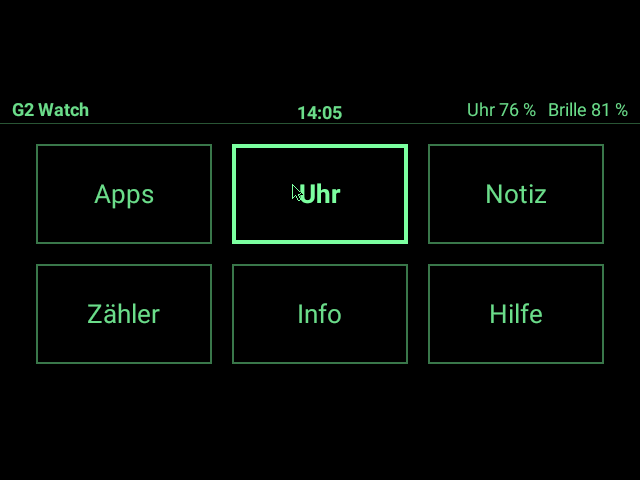 | 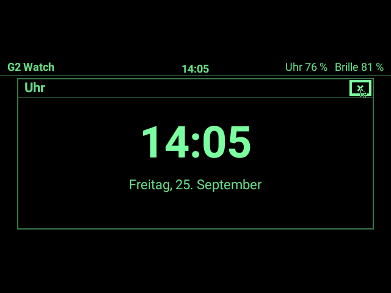 |
| **Fenster „Notiz“** | **Fenster „Zähler“** (3× auf „+“ geklickt) |
| 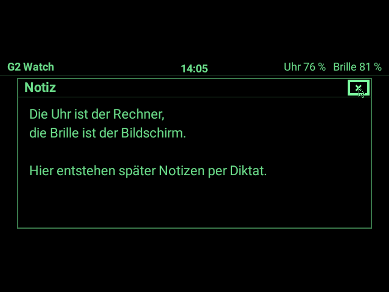 | 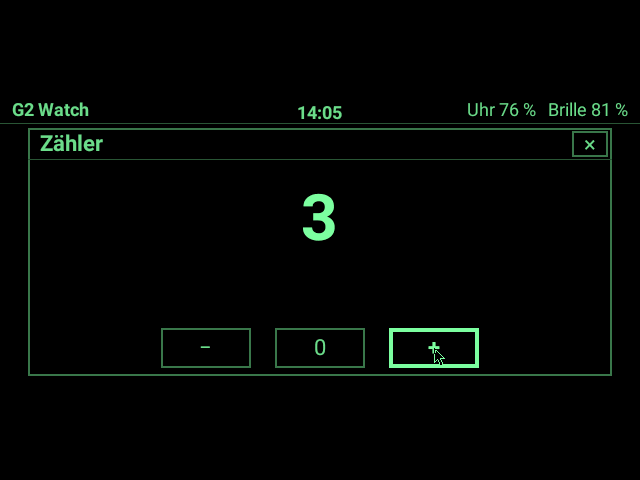 |
| **Kachel „Apps“: Starter** (seit 0.4.0, statt „Zeiger“) | **Fenster „Info“** |
|  | 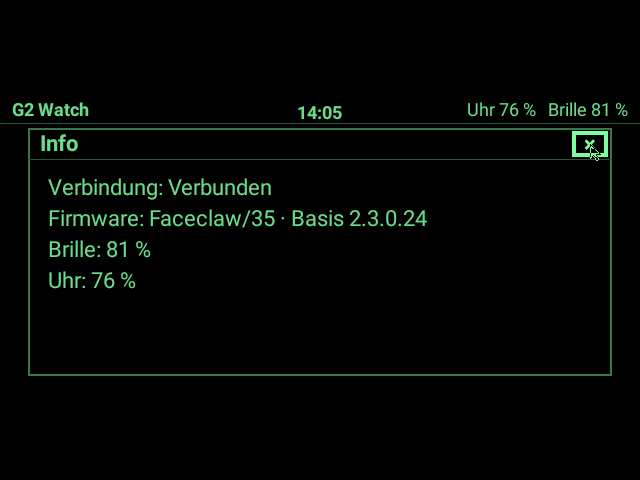 |
| **Fenster „Hilfe“** | |
| 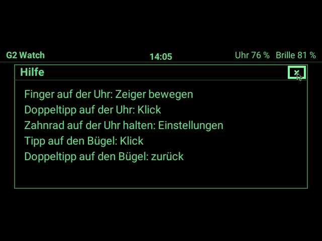 | |

Die Bilder zeigen das 640×480-Bild, das die App an die Brille schicken würde, in den 16 Grüntönen des Displays. Grün leuchtet; Schwarz leuchtet nicht und ist auf der Brille durchsichtig. Ein heller, dicker Rahmen markiert das Element unter dem Zeiger. Erzeugt hat die Bilder der eigene Renderer der App mit Androids Schrift, nicht die Brille (siehe [Bilder neu erzeugen](#bilder-neu-erzeugen)).

Auf der Uhr, gerendert für ein rundes Display mit 454 Pixeln (grau: außerhalb des Zifferblatts). Uhrzeit und Uhr-Akku sind für die Bilder fest auf 14:05 und 76 % gesetzt; wo ein Finger zu sehen ist, ist er im Test simuliert:

| Touchpad | Finger liegt auf | 2. Tipp: Rand leuchtet | Zahnrad halten |
|---|---|---|---|
|  |  |  |  |
| **Einstellungen** | **Log Uhr → Brille** | **Firmware** | **Zeiger und Verbindung** |
|  |  |  | 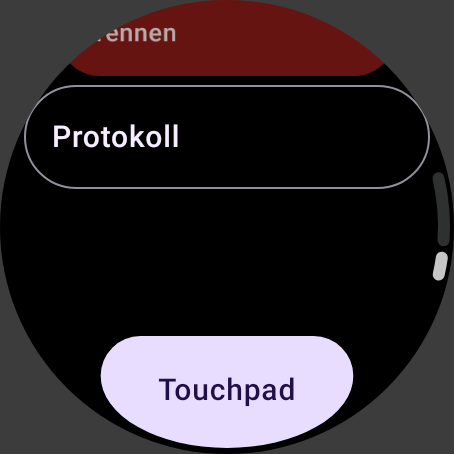 |
| **Firmware bestätigen** | **2 s halten** | **Übertragung** (Beispiel) | **Fertig** (Beispiel) |
| 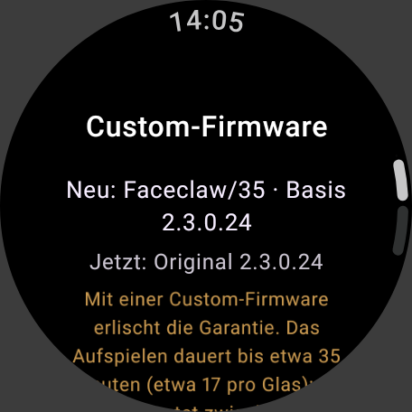 |  | 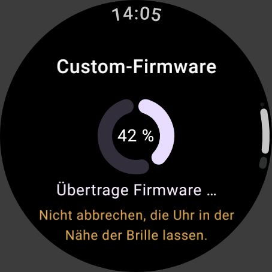 | 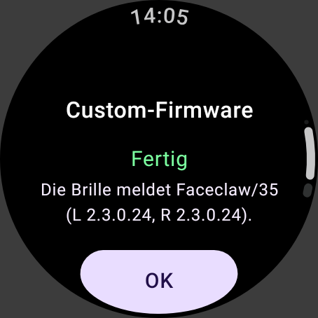 |
| **In dieser App: nicht eingerichtet** | **Brille nicht verbunden** | **Protokoll** | **Berechtigung** |
| 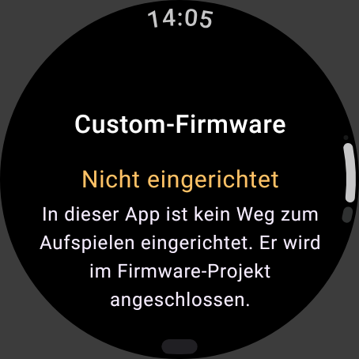 | 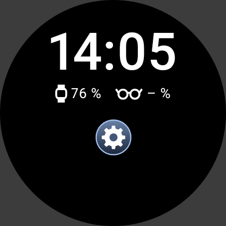 | 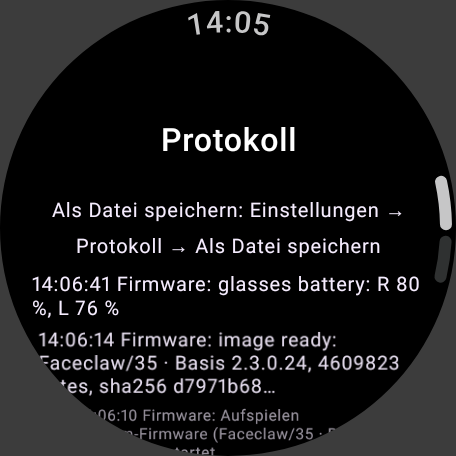 | 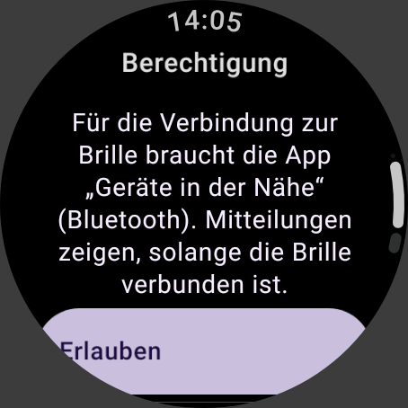 |
| **Brille wählen** | **Firmware-Prüfung** | **Firmware passt nicht** | |
| 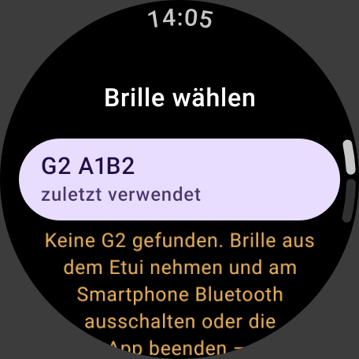 | 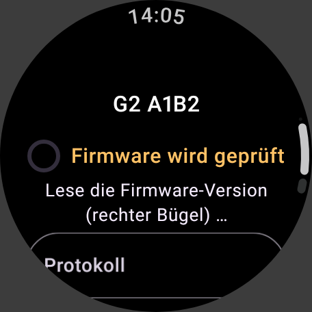 | 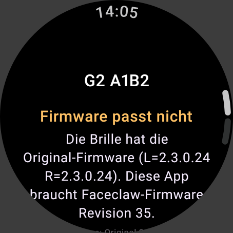 | |

Der Zeiger in der Lupe, normal über Dunklem, negativ über der hellen Ziffer der Uhr und halb über einer Kante:


Wie man Maus und Uhr-Oberfläche in ein anderes Projekt übernimmt, steht in [EINBAU_MAUS_UND_UHR.md](EINBAU_MAUS_UND_UHR.md).

## Stand (27.09.2026)

| Situation | Was die App tut | Geprüft |
|---|---|---|
| Ohne Brille | Die Uhr sucht Brillen und listet sie. Ein Touchpad ohne Brille gibt es nicht, weil die Uhr bewusst kein Bild der Brille zeigt. | Unit-Tests, Bilder oben |
| Brille mit Original-Firmware | verbindet, liest die Firmware-Version, hört auf und erklärt warum | Unit-Tests mit Attrappen |
| Brille mit Faceclaw-Firmware ab Revision 34 | zeigt den Desktop auf der Brille, Zeiger folgt dem Finger auf der Uhr | **nicht auf Hardware getestet** |

**Voraussetzung für die Anzeige auf der Brille** ist Faceclaws eigene Firmware in Revision 34. Das letzte Faceclaw-Release 0.7.2 (19.09.2026) arbeitet mit Revision 22. Revision 34 erzeugt der aktuelle g2flash-Quellstand (`main`, `814db36`). Ob und wann eine eigene Firmware auf die Brille kommt, entscheidest du. Risiken und Wege zurück stehen in [RECHERCHE_FIRMWARE.md](../RECHERCHE_FIRMWARE.md) (Stufe 4 des Stufenplans). Die App selbst enthält keinen Weg dorthin.

## Module

| Modul | Herkunft | Inhalt |
|---|---|---|
| `faceclaw-core` | Faceclaw `a6291cf`, unverändert | Kotlin-Multiplatform-Kern: G2-Protokoll, Sitzung (Verbindung, Authentifizierung, Heartbeat, Wiederverbinden, Leases), Compositor, Bildübertragung. 120 Dateien, rund 20 000 Zeilen, 180 eigene Tests. Siehe [UPSTREAM.md](../faceclaw-core/UPSTREAM.md). |
| `faceclaw-android` | Faceclaw `a6291cf`, unverändert | Androids GATT-Anbindung: `FaceclawBleManager`, `AndroidSessionLink`, `AndroidStockLink`, `FaceclawDeviceInfoProbe`. Siehe [UPSTREAM.md](../faceclaw-android/UPSTREAM.md). |
| `app` | eigen | Die Wear-OS-App, rund 3300 Zeilen Kotlin und 2000 Zeilen Tests |

Nicht übernommen ist Faceclaws Oberfläche: rund 88 000 Zeilen TypeScript für NativeScript auf dem Telefon, mit Shell, Apps, Terminal, Assistent und Flash-Assistent. Sie läuft nicht auf Wear OS. An ihre Stelle tritt eine kleine Desktop-Schicht in Kotlin. Der schwierige, wertvolle Teil, nämlich wie man mit der Brille spricht und Bilder effizient überträgt, steckt im Kotlin-Kern und läuft unverändert auf der Uhr.

### Pakete der App

| Paket | Klassen | Aufgabe |
|---|---|---|
| `glasses` | `GlassesConnection`, `FirmwareRequirement`, `GlassesParts`/`FaceclawParts`, `WearSessionHost`, `CoreDisplay`, `GlassesService`, `GlassesState`, `FirmwareInstaller` | Verbindung zur Brille: erst prüfen, dann Sitzung. Übersetzt Faceclaws Ereignisse (Status, Akku, Tipps am Bügel, Übertragungszeiten) für App und Desktop. `FirmwareInstaller` ist die Schnittstelle zum Aufspielen. |
| `desktop` | `Desktop`, `DesktopRenderer`, `DesktopController`, `Pointer`, `GrayRaster`, `AndroidTextPainter`, `GlassesDisplay` | Der Desktop: Layout, Kacheln, Fenster, Knöpfe, Zeiger. Zeichnet in ein 8-Bit-Graubild und reicht es an Faceclaws Compositor weiter. |
| `ui` | `TouchpadScreen`, `SettingsScreen`, `Screens`, `BatteryRow` | Die Uhr-Oberfläche mit Wear Compose Material 3: Touchpad mit Uhrzeit, Akkus, Zahnrad und Glasscheibe; Einstellungen mit Log, Firmware, Zeiger und Verbindung; dazu Geräte, Status und Protokoll |
| `ble` | `G2Scanner`, `G2Devices` | Suche nach den Bügeln, aus G2 Direct übernommen |
| Wurzel | `G2WatchApp`, `MainActivity`, `Scheduler` | Hält Desktop und Verbindung für den ganzen Prozess, Navigation |

## Datenfluss

```mermaid
flowchart LR
    TP["Touchpad auf der Uhr"] -- "Fingerbewegung, Doppeltipp" --> DC["DesktopController"]
    BR["Tipp am Bügel oder Ring"] -- "onRingEvent" --> GC["GlassesConnection"]
    GC -- "Klick / Zurück" --> DC
    GC -- "Akku, Verbindung, Übertragungszeiten" --> TP
    DC -- "Fläche desktop: 640×480, deckend, z 0" --> CD["CoreDisplay"]
    DC -- "Fläche pointer: 11×17, Farbschlüssel, z 100" --> CD
    CD --> SC["Faceclaw GlassesSessionCore:<br/>Compositor → Differenz → BLE"]
    SC -- "GATT, 2M PHY" --> G2["G2 mit Faceclaw-Firmware"]
```

- **Desktop:** eine deckende Fläche über den ganzen Bildschirm. Sie wird nur neu gezeichnet, wenn sich etwas ändert: Hover, Klick, Uhrzeit, Akkustand. Ihr Fingerabdruck ist ein Hash über die Pixel, damit Faceclaw Gleiches als „nichts zu tun“ erkennt.
- **Zeiger:** eine kleine Fläche mit Farbschlüssel darüber (Wert 0 durchsichtig, 1 schwarz). Bewegt sich der Zeiger, ändert sich nur die Position dieser Fläche, höchstens 30-mal pro Sekunde. Faceclaw vergleicht das neue Gesamtbild mit dem angezeigten und schickt nur den geänderten Bereich.
- **Negativ über hellen Stellen:** Jedes Zeigerpixel richtet sich nach dem Desktop-Pixel darunter. Über dunklen Pixeln ist der Umriss hell und die Füllung schwarz, ab halber Helligkeit ist es umgekehrt. Das geschieht mit derselben Bewegung. Ändert sich das Bild unter einem stehenden Zeiger, geht der neue Zeiger im selben Schritt mit, ohne auf den 30-pro-Sekunde-Takt zu warten.
- **Sichtbarer Streifen:** Wie in Faceclaws Standardlayout liegt alles in einem 288 Pixel hohen Streifen in der Mitte (y = 96 bis 383), weil die Optik nicht die ganze Panelhöhe zeigt.
- **Bewegung:** Die Uhr rechnet Fingerbewegung in Brillenpixel um, mit sanfter Beschleunigung, abgestimmt auf der Pixel Watch in G2 Direct. Langsame Striche sind präzise, schnelle Wischer überqueren den Bildschirm.
- **Nur in eine Richtung:** Bilder fließen nur von der Uhr zur Brille. Zur Uhr zurück kommen nur Akkustand, Verbindungsstufe, Tipps am Bügel und die Übertragungszeit jedes Bildes. Die Uhr zeichnet nichts vom Brillenbild nach.
- **Übertragungszeiten:** Faceclaw meldet nach jedem Bild, wie lange es von der Uhr bis zur Bestätigung der Brille gebraucht hat. Die Uhr behält die letzten 30 Werte und zeigt sie in den Einstellungen als Log.

## Sicherheit: erst prüfen, dann verbinden

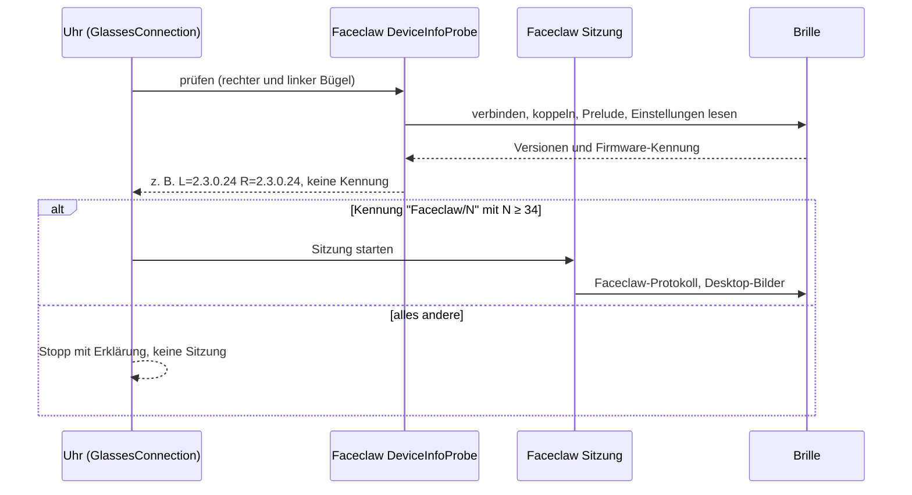

1. **Prüfen:** Faceclaws Device-Info-Probe verbindet sich wie die Even-App. Sie authentifiziert sich (bei der ersten Verbindung erscheint dabei die Kopplungsanfrage der Uhr), sendet den Sitzungsauftakt und liest die Einstellungen aus. Dabei wird nichts verändert und nichts angezeigt.
2. **Entscheiden:** `FirmwareRequirement` ist eine Portierung von Faceclaws `app/g2/firmware-compat.ts`. Nur die Kennung „Faceclaw/N“ mit N ≥ 34 führt zur Sitzung. Bei Original-Firmware, älterer Faceclaw-Firmware, fremder Custom-Firmware und ausbleibender Antwort bleibt die App stehen und erklärt warum. Anders als Faceclaws App verlangt die Uhr einen positiven Nachweis: Ohne Angabe gibt es keine Sitzung.
3. **Sitzung:** Erst jetzt startet Faceclaws Sitzung. Erst sie spricht das private Protokoll der Custom-Firmware. Weil sie nur nach bestandener Prüfung startet, erreicht keine ihrer Nachrichten eine Brille mit anderer Firmware. Meldet die Sitzung später eine unpassende Firmware, beendet die App sie, wie Faceclaw auch.
4. **Beenden:** Beim Trennen schickt Faceclaws Sitzung ihre Aufräumnachricht. Die Firmware kehrt dann zur normalen Anzeige zurück.

Die App schreibt von sich aus nie Firmware.

- **Einstellungen:** Sie bieten „Original-Firmware“ und „Custom-Firmware“ an. Übertragen wird aber nur über die Schnittstelle `FirmwareInstaller`, und nur nachdem der Knopf „Zum Aufspielen 2 s halten“ zwei Sekunden gehalten wurde.
- **Kein eingebauter Weg:** Diese App bringt `NotSetUpInstaller` mit, der nichts überträgt und „nicht eingerichtet“ meldet. Den echten Weg schließt das Firmware-Projekt an (siehe [EINBAU_MAUS_UND_UHR.md](EINBAU_MAUS_UND_UHR.md), Abschnitt 7).
- **Faceclaws Flash-Abläufe:** `OtaFlashFlow` und `FlashPromptFlow` stecken im unverändert übernommenen Kern. Die App ruft sie nirgends auf, und `NoFlashingTest` schlägt fehl, sobald App-Code sie verwendet.

Eine Designentscheidung, die sich leicht ändern lässt: Neuere Revisionen als 34 werden akzeptiert, wie in Faceclaws App, weil Revisionen den Vertrag laut Faceclaw nur erweitern. g2flash rät Fremdprojekten, nur exakt bekannte Kennungen zu akzeptieren. Soll die Uhr so streng sein, reicht in `FirmwareRequirement.check` ein `==` statt `>=`.

## Bedienung

| Wo | Geste | Wirkung |
|---|---|---|
| Uhr | Finger bewegen | Zeiger bewegen (relativ, springt nie); die Glasscheibe unter dem Finger folgt |
| Uhr | Doppeltipp | Klick am Zeiger beim Loslassen des zweiten Tipps; während des zweiten Tipps leuchtet der Rand der Scheibe hell, die Uhr vibriert beim Klick |
| Uhr | Zahnrad 0,9 s halten | Einstellungen; vorher füllt sich ein Ring um das Zahnrad. Tippen auf das Zahnrad tut nichts, Halten anderswo auch nicht. |
| Uhr | Krone drehen | Zeigertempo (0,3× bis 4×), 1,5 s lang als „Tempo 1,2ד angezeigt |
| Bügel oder Ring | Tipp | Klick am Zeiger |
| Bügel oder Ring | Doppeltipp | Fenster schließen |

Auf dem Desktop liegen sechs Kacheln: **Uhr** (große Uhrzeit), **Notiz** (Platzhalter für Diktat), **Zähler** (−, 0, +), **Zeiger** (Tempo und Zentrieren), **Info** (Verbindung, Firmware, Akkus) und **Hilfe**. Ein offenes Fenster ist modal und schließt sich über das × oben rechts oder per Doppeltipp am Bügel.

### Die Uhr beim Bedienen

Der Touchpad-Bildschirm (`ui/TouchpadScreen.kt`) ist schwarz. Oben mittig stehen untereinander:

1. **Uhrzeit**, 52 sp, weiß, im Format der Uhr. Die kleine Uhrzeit am Rand, die Wear OS sonst zeigt, ist hier ausgeblendet.
2. **Akku** von Uhr und Brille mit weißen Symbolen. Die Brille hat einen Stand nur, solange sie verbunden ist oder im Etui lädt (dann mit „⚡“), sonst steht „– %“. Die Einstellungen zeigen dieselbe Zeile nach derselben Regel.
3. **Zahnrad** in einem kleinen Glasknopf. Nur wenn der Finger 0,9 s darauf ruht, öffnen sich die Einstellungen.
4. Beim Drehen der Krone für 1,5 s das neue Tempo.

**Glasscheibe unter dem Finger:**

- Sie ist nur da, solange ein Finger aufliegt; beim Abheben verschwindet sie sofort.
- Sie ist deckend und hat 38 dp Radius.
- Das Glas geht von Schieferblau oben zu Dunkelblau unten, der hellblaue Rand leuchtet unten stärker.
- Bei der zweiten Berührung eines Doppeltipps leuchtet der Rand hell auf; das Loslassen klickt.

Maße, Farben und Zeiten stehen in [EINBAU_MAUS_UND_UHR.md](EINBAU_MAUS_UND_UHR.md), Abschnitt 5.

### Einstellungen

Sie öffnen sich über das Zahnrad (oder von der Statusseite, wenn die Firmware nicht passt). Von oben nach unten enthalten sie:

1. Die Akkus.
2. Das **Log der Übertragungszeiten** von der Uhr zur Brille: letzte Zeit groß, Durchschnitt, Balken der letzten 30 Bilder, Spanne, Bildzahl.
3. **Firmware:** was auf der Brille ist, dazu je ein Knopf für Original und Custom, mit Bestätigung durch 2 s Halten.
4. Zeiger-Tempo, Zeiger zentrieren, Fenster schließen.
5. Trennen oder Verbinden.
6. Das Protokoll.

## Laufzeit auf der Uhr

- `G2WatchApp` hält Desktop und Verbindung für den ganzen Prozess. Die Verbindung überlebt deshalb, wenn die Activity neu entsteht.
- `GlassesService` ist ein Vordergrunddienst vom Typ `connectedDevice`. Er läuft, solange geprüft oder verbunden wird, und zeigt eine laufende Mitteilung. Beendet wird er erst, wenn er im Vordergrund angekommen ist. Ein früheres Stoppen quittiert Android mit dem Beenden der ganzen App, was bei schnellem Verbinden und Abbrechen passieren könnte.
- Solange die Brille den Desktop zeigt, hält `WearSessionHost` einen Partial Wake Lock, wie Faceclaw auf dem Telefon. Er wird freigegeben, wenn die Brille lädt, wenn die Verbindung abreißt und neu aufgebaut wird und wenn getrennt wird. Das Neuverbinden kann Stunden dauern, wenn die Brille außer Reichweite ist, und die Uhr wacht dafür oft genug von selbst auf.
- Während der Prüfung und solange die Brille verbunden ist, bleibt das Uhrdisplay an, weil das Touchpad im Ambient-Modus nicht funktioniert. Lädt die Brille, ist sie außer Reichweite oder ist gar keine verbunden, geht es wie gewohnt aus.
- Die Glasscheibe und ihr Leuchten gibt es nur, solange ein Finger aufliegt. Ohne Berührung ändert sich der Touchpad-Bildschirm nur, wenn Uhrzeit oder Akkustand wechseln.
- Solange Firmware übertragen wird, bleibt das Display an, und die Fortschrittsseite bietet keinen Weg zurück.
- Threads: Der Desktop hat einen eigenen Thread und Faceclaws Sitzung einen Worker. Alles, was auf Bluetooth warten kann, läuft nacheinander auf einem Verbindungs-Thread. Dazu gehört auch das Schließen der Firmware-Prüfung: Faceclaws `FaceclawBleManager` hält bei jedem GATT-Schritt bis zu 5 s eine Sperre, die auch das Schließen braucht. Die Oberfläche wartet so nie auf Bluetooth und bekommt alles über `StateFlow`.

## Bauen und testen

JDK 25 ist vorgegeben: `gradle/gradle-daemon-jvm.properties` verlangt Java 25 für den Gradle-Daemon. Fehlt es, lädt der Foojay-Resolver es herunter. Werkzeuge: Gradle 9.7.1, AGP 9.4.1, Kotlin 2.4.20, compileSdk 37, minSdk 33 (Wear OS 4), Bytecode Java 17.

```sh
./gradlew :app:assembleDebug                 # APK: app/build/outputs/apk/debug/app-debug.apk
./gradlew :app:testDebugUnitTest             # 101 Tests der App (32 mit Robolectric); die 20 Bild-Tests werden übersprungen
./gradlew :faceclaw-core:testAndroidHostTest # Faceclaws 180 Tests gegen den übernommenen Kern
./gradlew :app:lintDebug
```

Stand 27.09.2026: Alle Tests sind grün. Lint meldet eine Warnung (`allowBackup`, bewusst: die App speichert nur die Adressen der zuletzt benutzten Brille).

| Test | Prüft |
|---|---|
| `FirmwareRequirementTest` | dieselben Fälle wie Faceclaws `firmware-compat.test.cjs`, dazu die strengere Regel ohne Angabe |
| `GlassesConnectionTest` | Ablauf mit Attrappen für Haupt- und Verbindungs-Thread: keine Sitzung ohne passende Firmware, auch nicht bei veralteten Rückmeldungen. Die Sitzung startet erst nach der Prüfung und endet, wenn sie andere Firmware meldet. Prüfung und Sitzung werden nie auf dem Haupt-Thread geschlossen, und eine neue Prüfung startet erst, wenn die alte Sitzung zu ist. Dazu fehlendes Bluetooth, Wake Lock, Tipp am Bügel, Akku, das Log der Übertragungszeiten und Trennen. |
| `GlassesServiceTest` | Vordergrunddienst: kein Stopp vor dem Ankommen im Vordergrund, kein zweiter Start, nichts ohne Bluetooth-Berechtigung (Robolectric) |
| `NoFlashingTest` | App-Code benutzt keine Flash-Abläufe |
| `DesktopTest`, `DesktopControllerTest` | Layout im sichtbaren Streifen, Klicks, modale Fenster, gebündelte Zeigerbilder, Neuzeichnen nur bei Änderungen. Der Zeiger wird mit derselben Bewegung negativ und zieht ohne Wartezeit nach, wenn sich das Bild unter ihm ändert. |
| `PointerTest`, `GrayRasterTest` | Zeigerbewegung, Grenzen, Sprite, Negativ pixelweise ab halber Helligkeit, Zeichnen, Fingerabdruck |
| `AndroidTextPainterTest` | echte Schriftdarstellung (Robolectric, native Grafik) |
| `TouchpadScreenTest` | Die Uhr wird gerendert und mit echten Touch-Gesten bedient (Robolectric). **Anzeige:** Uhrzeit und Akkus oben, das Zahnrad mittig darunter; kein Brillen-Akku ohne Verbindung, der Blitz beim Laden; nirgends Grün wie auf der Brille. **Gesten:** Bewegen und Doppeltipp wirken. Das Zahnrad öffnet nach 0,9 s Halten die Einstellungen, der Ring füllt sich; Tippen darauf tut nichts, Halten anderswo hält den Zeiger nicht auf. **Scheibe:** deckendes blaues Glas mit hellem Rand, folgt dem Finger, ist nach dem Abheben sofort weg; bei der zweiten Berührung eines Doppeltipps leuchten Rand und Schein heller, mit Bewegung gibt es keinen Klick. |
| `SettingsScreenTest` | Log mit letzter Zeit, Durchschnitt, Spanne, Balken und Bildzahl. Die Firmware-Knöpfe zeigen, was eingerichtet ist, und geben die Wahl weiter. Unter 2 s Halten wird nichts gesendet, bei 2 s genau einmal, und der Randknopf bricht ab. Während der Übertragung gibt es kein „OK“ (Robolectric). |
| `FirmwareInstallerTest` | `TransferStats` behält die letzten 30 Werte; `NotSetUpInstaller` bietet nichts an und überträgt nichts |

### Bilder neu erzeugen

```sh
./gradlew :app:testDebugUnitTest --tests '*SnapshotTest*' -PsnapshotDir=$PWD/docs/bilder
```

`RenderSnapshotTest` zeichnet die Brillenbilder und die Zeiger-Lupe. `WatchSnapshotTest` zeichnet die Uhr-Bildschirme und die Finger-Zustände, die Gesten laufen dabei durch den echten Gestenerkenner. Beide nutzen Robolectric mit nativer Grafik. Uhrzeit (14:05) und Uhr-Akku (76 %) sind fest gesetzt, damit die Bilder bei jedem Lauf gleich ausfallen. Ohne `-PsnapshotDir` werden beide übersprungen.

### Faceclaw aktualisieren

Den übernommenen Code nie von Hand ändern, sondern mit `scripts/sync-faceclaw-core.sh /pfad/zu/faceclaw` auf einen neuen Stand heben. Danach die Tests laufen lassen, die UPSTREAM-Dateien nachführen und `FirmwareRequirement.REQUIRED_REVISION` auf die Revision setzen, die Faceclaw dann verlangt.

## Lizenz

Faceclaw steht unter der GPL-3.0. Weil die App seinen Code enthält, gilt die GPL-3.0 auch für die App (siehe [LICENSE](../LICENSE)). Wer die App weitergibt, muss den Quelltext mitgeben.

## Nächste Schritte

1. **Auf der Uhr ausprobieren (sicher):** APK installieren, dann mit der Brille die Firmware-Prüfung laufen lassen. Mit Original-Firmware endet sie bei „Firmware passt nicht“, und genau das ist erwünscht.
2. **Entscheidung Firmware (bei dir):** siehe Stufenplan in RECHERCHE_FIRMWARE.md. Erst danach wird im Firmware-Projekt ein echter `FirmwareInstaller` angeschlossen; bis dahin melden die Firmware-Knöpfe „nicht eingerichtet“.
3. **Erst mit Faceclaw-Firmware:** Verhalten auf Hardware prüfen, also Latenz des Zeigers, Lesbarkeit, Größe und Schimmern der Scheibe, Akkuverbrauch von Uhr und Brille und Verhalten beim Wiederverbinden.
4. **Ausbau:** Notiz per Diktat (Faceclaws Kern bringt Mikrofon und Sprach-Endpunkt mit), Benachrichtigungen der Uhr auf der Brille, Helligkeit über Faceclaws `configureBrightness` und Blick-nach-oben-Wecken über die IMU-Ereignisse.
