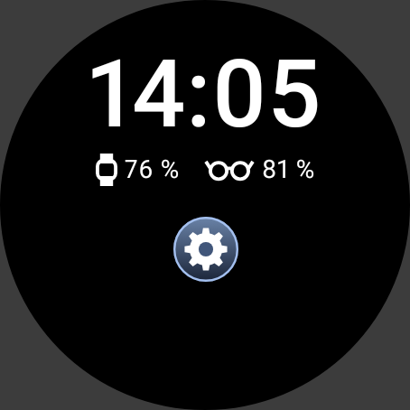
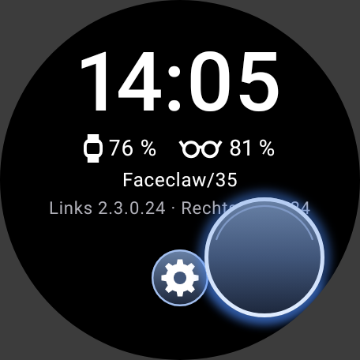
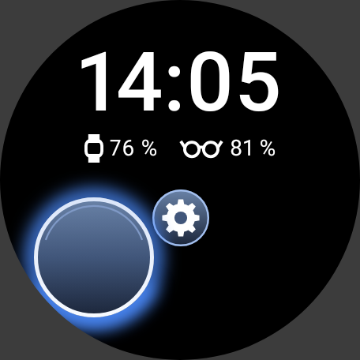
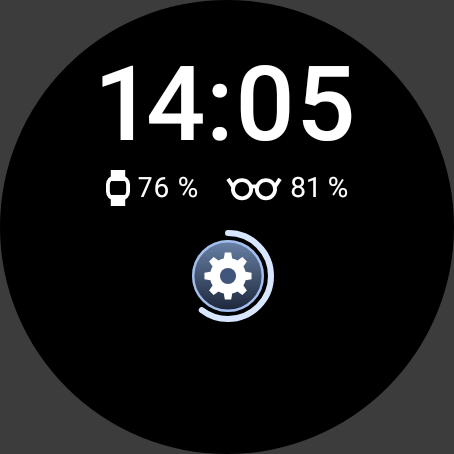
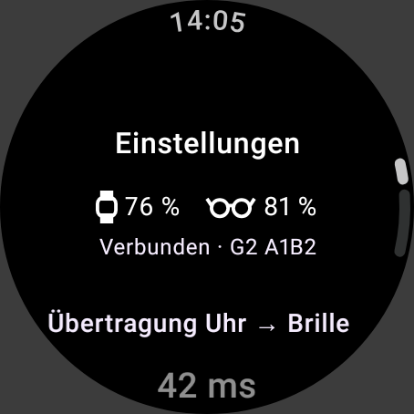
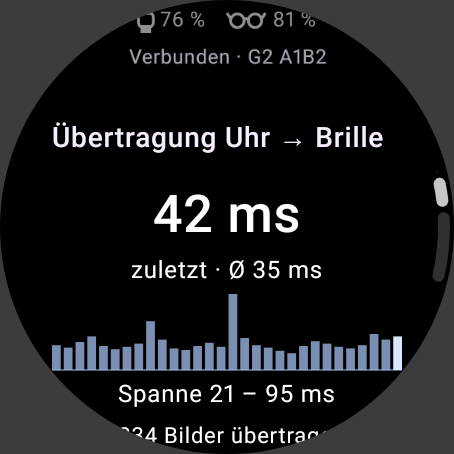
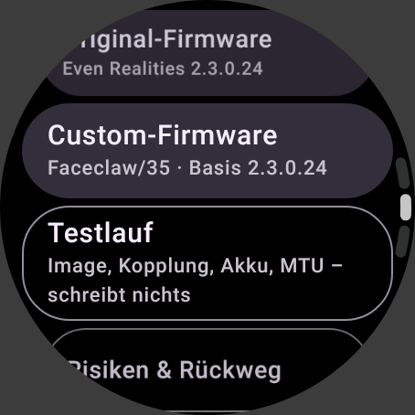
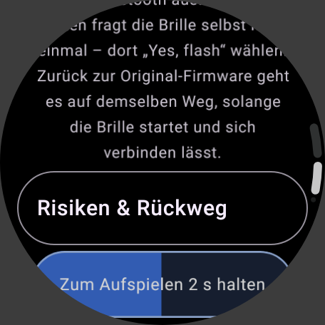
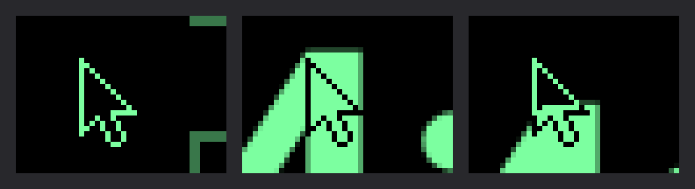

> **Hinweis (G2 Watch 0.2.0):** Diese Dokumente beschreiben das Uhr-Paket *vor* dem Anschluss der
> Firmware. Inzwischen ist der Weg zum Aufspielen eingebaut (`WatchFirmwareInstaller`, siehe
> [`../FIRMWARE.md`](../FIRMWARE.md)), `NoFlashingTest` ist durch `FlashingBoundaryTest` ersetzt und die
> App verlangt genau Faceclaw-Firmware **Revision 35** (Faceclaw 0.8.0) statt „34 oder neuer“.
> Alles zu Maus, Touchpad und Einstellungen gilt weiter.

# Maus und Uhr-Oberfläche – Nachbau und Einbau in ein anderes Projekt

Diese Anleitung beschreibt die Bausteine aus der App G2 Watch so genau, dass man sie nachbauen oder in ein anderes Projekt übernehmen kann:

1. **Die Maus auf der Brille.** Das Uhrdisplay dient als relatives Touchpad. Ein Zeiger auf der Brille folgt dem Finger und wird über hellen Stellen sofort negativ.
2. **Die Oberfläche auf der Uhr:**
   - Oben stehen die Uhrzeit und der Akku von Uhr und Brille, darunter mittig ein Zahnrad.
   - Solange ein Finger aufliegt, sitzt darunter eine dunkle Glasscheibe mit blau leuchtendem Rand. Beim Klick leuchtet der Rand hell auf.
   - Ein Bild der Brille zeigt die Uhr nicht.
3. **Die Einstellungen** hinter dem Zahnrad:
   - Log der Übertragungszeiten von der Uhr zur Brille in Millisekunden.
   - Knöpfe für Original- und Custom-Firmware.
   - Zeiger und Verbindung.

Den Code findest du im Repo `MADTreasures/ER-G2_own_firmware` auf dem Branch `claude/laughing-dijkstra-aes5wg`. Alle Pfade unten beziehen sich auf `app/src/main/java/ch/madtreasures/g2watch/`.

| Uhr ohne Finger | Finger bewegt | Zweiter Tipp: Rand leuchtet | Zahnrad halten |
|---|---|---|---|
|  |  |  |  |
| **Einstellungen** | **Log in ms** | **Firmware** | **Bestätigen: 2 s halten** |
|  |  |  |  |

Der Zeiger auf der Brille in der Lupe, normal über Dunklem, negativ über der hellen Ziffer der Uhr und halb über einer Kante:



Die Bilder stammen aus dem eigenen Renderer der App und aus Robolectric. Wo ein Finger zu sehen ist, ist er im Test simuliert. Auf echter Hardware ist nichts davon getestet.

---

## 1. Bausteine und Dateien

| Datei | Inhalt | Hängt ab von | Übernehmen |
|---|---|---|---|
| `desktop/Pointer.kt` | `PointerSprite`: Pfeilform, Zeichnen normal oder negativ, Fingerabdruck. `PointerPosition`: Position im sichtbaren Bereich. `PointerMotion`: Umrechnung Finger → Brillenpixel mit Beschleunigung. | `GrayRaster` | unverändert |
| `desktop/GrayRaster.kt` | 8-Bit-Graubild mit Zeichenfunktionen und FNV-1a-Hash | – | unverändert |
| `desktop/GlassesDisplay.kt` | Schnittstelle `GlassesDisplay` (Flächen konfigurieren, Inhalt senden) und `TextPainter` | – | unverändert |
| `desktop/DesktopController.kt` | Hält Desktop und Zeiger auf einem eigenen Thread. Bündelt Zeigerbilder und zieht den Zeiger nach, wenn sich das Bild ändert. `frame` liefert das zuletzt gezeichnete Bild, nur für Tests und Werkzeuge. | alles oben, `Scheduler.kt` | unverändert oder als Vorlage |
| `desktop/Desktop.kt`, `DesktopRenderer.kt`, `AndroidTextPainter.kt`, `EmojiText.kt` | Der Beispiel-Desktop: Kacheln, Fenster, Knöpfe, Schrift; Emoji mit `assets/fonts/NotoEmoji.ttf` (SIL OFL 1.1, Lizenz daneben) | Android-Grafik | optional, durch eigene Inhalte ersetzbar; ohne die Schrift zeichnet Android Emoji als Klecks |
| `Scheduler.kt` | `Scheduler`, `ThreadScheduler`, `MainScheduler` | – | unverändert |
| `glasses/CoreDisplay.kt` | `GlassesDisplay` über Faceclaws `GlassesSessionCore` | Faceclaw-Kern | nur mit Faceclaw-Kern |
| `glasses/GlassesState.kt` | Was die Uhr über die Brille zeigt, dazu `TransferStats`: die Übertragungszeiten der letzten 30 Bilder | `FirmwareRequirement.kt` | unverändert |
| `glasses/FirmwareInstaller.kt` | Schnittstelle zum Aufspielen von Firmware (`FirmwareInstaller`, `FirmwareTarget`, `FirmwareInstall`) und `NotSetUpInstaller`, der nichts überträgt | – | unverändert; den echten Weg schließt das Firmware-Projekt an (Abschnitt 7) |
| `ui/TouchpadScreen.kt` | `TouchpadScreen` (Uhrzeit, Akkus, Zahnrad, ganzes Display als Touchpad), die Glasscheibe (`TouchFeedback`, `TouchFeedbackLayer`) und der Gestenerkenner `relativeTouchpad` | Wear Compose, `GlassesState`, `PointerMotion` | unverändert |
| `ui/SettingsScreen.kt` | `SettingsScreen` mit Log, Firmware, Zeiger und Verbindung; `FirmwareConfirmScreen` (2 s halten) und `FirmwareProgressScreen` | Wear Compose, `GlassesState`, `FirmwareInstaller.kt` | unverändert |
| `ui/BatteryRow.kt` | Akku-Zeile von Uhr und Brille in Weiß mit gezeichneten Symbolen. `BatteryRow(watch, glasses)` zeigt den Brillen-Akku nur bei verbundener oder ladender Brille, `rememberWatchBattery()` liest den Akku der Uhr. | Wear Compose, `GlassesState` | unverändert |
| `ui/Screens.kt` | Geräte, Status, Protokoll, dazu `CenterText` und die Warnfarben | Wear Compose, `GlassesState` | `CenterText` und Farben nötig, der Rest optional |

Die Tests dazu liegen unter `app/src/test/java/ch/madtreasures/g2watch/` (Abschnitt 9).

---

## 2. Wie die Maus funktioniert

**Zwei Flächen:** Das Brillenbild hat 640 × 480 Pixel mit 16 Graustufen (8-Bit-Werte, die Brille zeigt die oberen 4 Bit) und besteht aus zwei Flächen.

| Fläche | Größe | Z-Reihenfolge | Transparenz |
|---|---|---|---|
| `desktop` | 640 × 480 | 0 | deckend |
| `pointer` | 11 × 17 | 100 | Farbschlüssel: 0 = durchsichtig, 1 = schwarz, 255 = leuchtend |

Bewegt sich der Zeiger, ändert sich nur die Position der kleinen Fläche. Der Compositor vergleicht das neue Gesamtbild mit dem angezeigten und schickt nur die geänderten Zeilen.

**Negativ über hellen Stellen:** Der Pfeil hat Umriss- und Füllpixel. Für jedes Pixel entscheidet, was darunter liegt (`PointerSprite.render`):

| Desktop-Pixel darunter | Umriss | Füllung |
|---|---|---|
| dunkel (< 128) | leuchtend (255) | schwarz (1) |
| hell (≥ 128, halbe Helligkeit) | schwarz (1) | leuchtend (255) |

Pixel außerhalb des Bildschirms zählen als dunkel. Weil jedes Pixel für sich entscheidet, bleibt der Pfeil auch halb über einer Kante oder über einem Bild sichtbar. Die Schwelle 128 gibt in beiden Fällen den größten Mindestkontrast.

**Ohne Verzögerung:**
- Bei jeder Bewegung wird der Zeiger sofort gegen das aktuelle Bild neu gezeichnet. Die Brille bekommt ihn mit dem nächsten Zeigerbild. Zeigerbilder gehen höchstens alle 33 ms raus (`POINTER_INTERVAL_MS`, etwa 30 pro Sekunde). Position und Negativ kommen im selben Bild an.
- Ändert sich das Bild unter einem stehenden Zeiger, zieht der Zeiger ebenfalls sofort nach. Das passiert etwa, wenn ein Fenster aufgeht oder ein Knopf hervorgehoben wird. `flushDesktop()` zeichnet dann den Zeiger neu und sendet ihn im selben Schritt, ohne auf den 33-ms-Takt zu warten.
- Ein unveränderter Zeiger an unveränderter Stelle wird nicht erneut gesendet. Das prüfen Fingerabdruck und Position.

**Fingerabdruck:** Er lautet `pointer:` plus ein 64-Bit-FNV-1a-Hash über die Zeigerpixel. Ändern sich die Pixel, ändert sich der Fingerabdruck. Die Position gehört zur Geometrie der Fläche.

**Bewegung:** `PointerMotion.toGlasses` rechnet die Fingerbewegung in Brillenpixel um. Die Formel lautet `dp × 2,6 × Tempo × Beschleunigung`. Die Beschleunigung ist `0,55 + Geschwindigkeit × 1,2`, begrenzt auf 0,55 bis 2,6. Das Tempo liegt zwischen 0,3 und 4 und lässt sich über die Krone, das Menü oder das Fenster „Zeiger“ einstellen. Der Zeiger bleibt im sichtbaren Streifen: 640 × 288 Pixel, bei y = 96 bis 383.

**Bekannte Grenze:** Desktop und Zeiger gehen als zwei Sendungen raus. Dazwischen kann für ein Bild die neue Oberfläche mit dem alten Zeiger entstehen. Mit Faceclaws Kern wird dieses Zwischenbild meist schon vor dem Senden vom nächsten ersetzt.

---

## 3. Einbau mit Faceclaws Kern (wie in G2 Watch)

1. **Dateien kopieren:** alles aus Abschnitt 1, was du brauchst, dazu `glasses/CoreDisplay.kt`. Die Paketnamen passt du an.
2. **Controller anlegen:** einmal pro Prozess, zum Beispiel in der `Application`:
   ```kotlin
   val desktop = DesktopController(AndroidTextPainter(AndroidTextPainter.emojiFont(assets))).also { it.startClock() }
   val firmware: FirmwareInstaller = NotSetUpInstaller()   // bis das Firmware-Projekt seinen Weg anschließt
   ```
3. **Mit der Sitzung verbinden:** In genau dieser Reihenfolge, wie Faceclaw es auch macht:
   ```kotlin
   val timings = FrameTimingsCore()
   val core = GlassesSessionCore(AndroidSessionLink(bleManager), host, timings, AndroidProtocolPlatform, right, left, null)
   bleManager.setListener(core)
   core.configureCompositorScreen(640, 480)          // vor jeder Fläche
   desktop.attach(CoreDisplay(core, timings))         // legt desktop und pointer an und sendet beide
   core.setListener(listener)
   core.start()
   ```
   Beim Trennen `desktop.detach()` aufrufen, **bevor** die Sitzung geschlossen wird. Das Schließen blockiert und gehört auf einen Hintergrund-Thread (siehe `glasses/GlassesConnection.kt`).
4. **Bildschirme verdrahten** (wie in `MainActivity.kt`):
   ```kotlin
   Screen.TOUCHPAD -> TouchpadScreen(
       glasses = state,                                // GlassesState: Stufe, Akku, Laden, Übertragungszeiten
       speed = speed,                                  // desktop.speed
       onMove = { dx, dy -> desktop.moveBy(dx, dy) },
       onSpeed = { desktop.setSpeed(it) },
       onClick = { desktop.click() },
       onOpenSettings = { screen = Screen.SETTINGS },  // Zahnrad gehalten
   )
   Screen.SETTINGS -> SettingsScreen(
       state = state, speed = speed,
       describeFirmware = firmware::describe,
       onBack = { screen = Screen.TOUCHPAD },
       onCloseWindow = { desktop.back() }, onCenter = { desktop.centerPointer() },
       onSpeed = { desktop.setSpeed(it) },
       onConnect = { … }, onDisconnect = { … },
       onFirmware = { target -> firmwareTarget = target; screen = Screen.FIRMWARE_CONFIRM },
       onLog = { screen = Screen.LOG },
   )
   Screen.FIRMWARE_CONFIRM -> FirmwareConfirmScreen(
       target = firmwareTarget,
       description = firmware.describe(firmwareTarget),
       onGlasses = state.firmware?.summary,
       onCancel = { screen = Screen.SETTINGS },
       onConfirm = { firmware.install(firmwareTarget); screen = Screen.FIRMWARE_PROGRESS },
   )
   Screen.FIRMWARE_PROGRESS -> FirmwareProgressScreen(install, onClose = { firmware.dismiss(); screen = Screen.SETTINGS })
   ```
   Dazu gehört ein `BackHandler`, der auf der Fortschrittsseite nichts tut, solange `install is FirmwareInstall.Running` ist.
5. **Eingaben von der Brille:** Im Listener der Sitzung, in `onRingEvent` bei `kind == "sys-event"`:
   - `BleProtocol.EVENT_CLICK` löst `desktop.click()` aus.
   - `BleProtocol.EVENT_DOUBLE_CLICK` löst `desktop.back()` aus.
6. **Akku:**
   - Die Brille liefert ihren Stand über `onBatteryState`. Er geht an `desktop.updateStatus { it.copy(glassesBattery = …, glassesCharging = …) }` für die Kopfzeile auf der Brille.
   - Auf der Uhr zeigt `BatteryRow(watchBattery, glasses)` beide Stände. `TouchpadScreen` und `SettingsScreen` rufen sie schon auf.
7. **Übertragungszeiten:**
   - Faceclaw meldet nach jedem Bild `onFrameMetrics(paintMs, transmitMs, tileCount)`. `transmitMs` ist die Zeit von der Uhr bis zur Bestätigung der Brille.
   - `GlassesConnection` behält die letzten 30 Werte und legt sie höchstens alle 500 ms als `TransferStats.of(werte)` in den Zustand (`GlassesState.transfer`).
   - Bei einer neuen Verbindung beginnt das Log von vorn.

---

## 4. Einbau mit eigenem Protokoll oder eigener Firmware

Die Maus braucht vom Transport nur die zwei Methoden von `GlassesDisplay`:

```kotlin
interface GlassesDisplay {
    fun configureSurface(id: String, x: Int, y: Int, width: Int, height: Int, zOrder: Int, colorKey: Boolean)
    fun submit(id: String, pixels: ByteArray, width: Int, height: Int, fingerprint: String)
}
```

- **Hat die eigene Seite einen Compositor mit Flächen**, wird `GlassesDisplay` direkt darauf abgebildet. Die Flächen werden in aufsteigender Z-Reihenfolge auf Schwarz gelegt; bei `colorKey` ist 0 durchsichtig und 1 schwarz. `submit` ersetzt den ganzen Inhalt einer Fläche. Ein gleicher Fingerabdruck bei gleicher Geometrie heißt: nichts zu tun.
- **Gibt es nur einen Bildspeicher**, legt die Implementierung von `GlassesDisplay` die beiden Flächen selbst übereinander. Sie merkt sich dazu den Inhalt und die Position jeder Fläche. `PointerSprite.render` liefert die fertigen Zeigerpixel, das Übereinanderlegen ist dann ein einfaches Kopieren mit Farbschlüssel.
- **Kann die Firmware Sprites**, zum Beispiel Display-Listen mit Rechteck-Kopien wie g2flash, ist der Zeiger dort am besten aufgehoben. Die Negativ-Regel könnte dann sogar auf der Brille laufen: Beim Kopieren wird pro Pixel gegen den Bildspeicher geprüft, die Uhr schickt nur noch Positionen. Das ist eine Idee, sie ist nicht umgesetzt.

---

## 5. Touchpad-Bildschirm nachbauen

**Abhängigkeiten** (Stand in G2 Watch):

| Bibliothek | Version |
|---|---|
| Wear Compose Material 3 | 1.7.0 |
| Wear Compose Foundation | 1.7.0 |
| `activity-compose` | 1.13.0 |
| `lifecycle-runtime-compose` | 2.11.0 |
| `core-ktx` | 1.19.1 |

Kotlin ist 2.4.20 mit Compose-Plugin, `minSdk` 33 (Wear OS 4), gebaut mit JDK 25.

**Theme:** Im Theme `android:windowSwipeToDismiss` auf `false` setzen, sonst schließt Wear OS die App bei waagrechten Wischern auf dem Touchpad (siehe `res/values/themes.xml`).

**Aufruf:** `TouchpadScreen(glasses, speed, onMove, onSpeed, onClick, onOpenSettings, timeSource)`

- `glasses` ist der `GlassesState` mit `stage`, `battery` und `charging`.
- `speed` und `onSpeed` sind das Zeigertempo, die Krone ändert es.
- `onMove(dx, dy)` bekommt die Bewegung in Brillenpixeln, schon mit `PointerMotion` umgerechnet (Abschnitt 2).
- `onClick` kommt beim Doppeltipp, `onOpenSettings`, wenn das Zahnrad 900 ms gehalten wurde.
- `timeSource` liefert die Uhrzeit. Vorgegeben ist `TimeTextDefaults.rememberTimeSource(TimeTextDefaults.timeFormat())`, also die Systemzeit im Format der Uhr. Tests setzen eine feste Zeit ein.

**Aufbau:**

| Teil | Umsetzung |
|---|---|
| Rahmen | `ScreenScaffold(timeText = {})`. Das blendet die kleine Uhrzeit am Rand aus, die `AppScaffold` sonst auf jeden Bildschirm legt. |
| Hintergrund | Schwarz. Das ganze Display ist Touchpad (`pointerInput`) und nimmt die Krone an (`onRotaryScrollEvent` mit `focusRequester` und `focusable`). |
| Oben | eine `Column`, oben mittig mit 22 dp Abstand zum Rand, 2 dp zwischen den Zeilen |
| Uhrzeit | `Text(timeSource.currentTime())`, 52 sp, `FontWeight.Medium`, Weiß |
| Akku-Zeile | `BatteryRow(rememberWatchBattery(), glasses)` |
| Zahnrad | 8 dp darunter, ein Knopf von 46 dp |
| Tempo | nur 1,5 s nach dem Drehen der Krone, z. B. „Tempo 1,2ד, 14 sp, Weiß, unter dem Zahnrad |
| Glasscheibe | `TouchFeedbackLayer`, bildschirmgroß über allem, zeichnet nur, solange ein Finger aufliegt |

**Akku-Zeile** (`BatteryRow`):

- **Aufbau:** Die Zeile besteht in dieser Reihenfolge aus:
  - Uhrsymbol, 12 × 18 dp
  - 4 dp Abstand, dann Stand der Uhr
  - 14 dp Abstand
  - Brillensymbol, 26 × 12 dp
  - 5 dp Abstand, dann Stand der Brille

  Der Text hat 14 sp. Symbole und Text sind immer Weiß.
- **Symbole:** Sie sind mit Canvas gezeichnet, keine Emojis. Die Uhr ist ein abgerundetes Gehäuse mit Armbandstummeln, die Brille zwei Kreise mit Steg und Bügeln.
- **Text:** „76 %“, beim Laden „76 % ⚡“, ohne Wert „– %“.
- **Uhr-Akku:** `rememberWatchBattery()` liest ihn aus dem Sticky-Broadcast `ACTION_BATTERY_CHANGED` und folgt Änderungen.
- **Brillen-Akku:** Er steht nur in den Stufen `CONNECTED` und `CHARGING` da. In allen anderen Stufen steht „– %“, auch beim Neuverbinden, weil der letzte Wert dann veraltet wäre.

**Zahnrad** (`GearButton`):

- **Knopf:** 46 dp groß. Innen liegt ein Glasknopf mit 18 dp Radius, mit demselben Verlauf wie die Scheibe und einem 1,2 dp breiten hellblauen Rand (`#A3BFEE`).
- **Symbol:** ein weißes Zahnrad mit 8 Zähnen, Radius 0,66 × Knopfradius, Zahnfuß bei 0,76. Das Loch in der Mitte hat 0,34 × Radius und die Farbe `#41567A`.
- **Halten:** Solange der Finger auf dem Zahnrad ruht, wächst außen ein 3 dp breiter Ring (`#D8E7FF`, runde Enden). Er beginnt oben, läuft im Uhrzeigersinn und ist in 900 ms voll. Dann öffnen sich die Einstellungen, und die Uhr vibriert (`LongPress`).
- **Tippen:** Ein Tipp oder Doppeltipp auf das Zahnrad tut nichts, es öffnet nur beim Halten. Als „auf dem Zahnrad“ zählt ein Kreis von 1,15 × Knopfradius um seine Mitte.
- **Wegziehen:** Bewegt sich der Finger vom Zahnrad weg, wird die Berührung zur Mausbewegung. Der Ring verschwindet, die Scheibe erscheint.
- **Nur dort:** Halten an jeder anderen Stelle öffnet nichts, und der Finger kann danach den Zeiger weiter bewegen.

**Glasscheibe unter dem Finger:** Sie ist **nur sichtbar, solange ein Finger aufliegt**. Beim Abheben verschwindet sie sofort, auch wenn die Geste abgebrochen wird. Nach dem Loslassen bleibt nichts stehen. Die Scheibe ist deckend, Text darunter scheint nicht durch.

| Zustand | Darstellung |
|---|---|
| Finger liegt auf oder bewegt sich | Die Scheibe mit 38 dp Radius, die Mitte genau unter dem Finger. Sie folgt jedem Touch-Ereignis, auch innerhalb der Toleranz. Der Rand leuchtet ruhig (Glühen 0,3). |
| Zweite Berührung eines Doppeltipps | Beginnt sie höchstens 400 ms nach dem Ende des ersten Tipps, leuchtet der Rand in 80 ms hell auf (Glühen 1). Das heißt: Loslassen klickt. Bleibt der Finger länger als 300 ms liegen, klickt Loslassen nicht mehr, und der Rand beruhigt sich wieder. |
| Loslassen nach der zweiten Berührung | Klick am Zeiger, die Uhr vibriert (`Confirm`), die Scheibe ist weg. |
| Bewegung während der zweiten Berührung | Kein Klick; der Rand beruhigt sich, der Zeiger fährt. |
| Finger auf dem Zahnrad | Keine Scheibe, stattdessen der Ring ums Zahnrad. |

**Farben und Maße der Scheibe** (nach der Vorlage des Nutzers):

| Teil | Wert |
|---|---|
| Glas | senkrechter Verlauf `#6A83A8` (oben) → `#41567A` → `#1B2539` (unten), deckend |
| Rand | 2,5 dp, senkrechter Verlauf von `#A3BFEE` (oben) nach `#D8E7FF` (unten). Beim Glühen wird er weißer: oben um 0,6 × Glühen, unten um 0,8 × Glühen. |
| Zweite Kante | ein dünner Bogen (0,45 × Randbreite) in `#7F99C6` im oberen Teil, von 200° über 140°, bei Radius − 2,2 × Randbreite |
| Schein ringsum | `#4C8DFF`, weichgezeichnet (`BlurMaskFilter`): Breite Rand × (1,6 + 2,4 × Glühen), Deckkraft 0,5 + 0,5 × Glühen, Unschärfe Radius × (0,10 + 0,14 × Glühen) |
| Schein unten | wie oben, zusätzlich auf dem unteren Bogen von 25° bis 155°: Breite Rand × (2,2 + 3 × Glühen), Deckkraft 0,3 + 0,6 × Glühen |
| Glühen | 0,3 in Ruhe, 1 bei der zweiten Berührung eines Doppeltipps |

Der Kern der Zeichnung:

```kotlin
private fun DrawScope.drawGlassDisc(center: Offset, radius: Float, glow: Float) {
    val rim = minOf(RIM.toPx(), radius)                                     // RIM = 2.5.dp
    drawIntoCanvas { canvas ->                                              // Schein, weichgezeichnet
        val halo = android.graphics.Paint(ANTI_ALIAS_FLAG).apply {
            style = STROKE
            strokeWidth = rim * (1.6f + 2.4f * glow)
            color = HALO.copy(alpha = 0.5f + 0.5f * glow).toArgb()
            maskFilter = BlurMaskFilter(radius * (0.10f + 0.14f * glow), BlurMaskFilter.Blur.NORMAL)
        }
        canvas.nativeCanvas.drawCircle(center.x, center.y, radius, halo)
        halo.strokeWidth = rim * (2.2f + 3f * glow)                         // unten stärker
        halo.color = HALO.copy(alpha = 0.3f + 0.6f * glow).toArgb()
        canvas.nativeCanvas.drawArc(/* Kreis um center */, 25f, 130f, false, halo)
    }
    drawCircle(Brush.verticalGradient(listOf(GLASS_TOP, GLASS_MID, GLASS_BOTTOM), …), radius, center)
    drawCircle(Brush.verticalGradient(listOf(lerp(RIM_TOP, White, 0.6f * glow), lerp(RIM_BOTTOM, White, 0.8f * glow)), …),
        radius - rim / 2, center, style = Stroke(rim))
    drawArc(INNER_EDGE, 200f, 140f, false, /* Radius - 2.2 × rim */, style = Stroke(rim * 0.45f))
}
```

**Gesten** (`relativeTouchpad`, aus G2 Direct übernommen):

- **Nur Bewegung zählt:** Setzt man den Finger woanders auf, springt der Zeiger nicht. Hebt der erste Finger ab, während ein zweiter liegt, geht es mit dem zweiten weiter, ebenfalls ohne Sprung.
- **Toleranz:** Bewegung innerhalb der Touch-Toleranz (`touchSlop`) wird zurückgehalten, bis der Finger sich klar bewegt. Dann geht sie mit. So verschiebt ein Tipp den Zeiger nie, und nichts geht verloren.
- **Klick:** Ein Tipp dauert höchstens 300 ms und bleibt innerhalb der Toleranz. Beginnt ein zweiter Tipp höchstens 400 ms nach dem Ende des ersten, klickt sein Loslassen. Eine Bewegung dazwischen bricht das ab.
- **Halten:** Nach 900 ms Ruhe bekommt `onLongPress` die Stelle, an der der Finger aufgesetzt wurde. Liegt sie auf dem Zahnrad, öffnen sich die Einstellungen und der Rest der Berührung zählt nicht mehr. Sonst geht die Berührung normal weiter.
- **Krone:** Das Tempo ändert sich um die Drehung in Pixeln geteilt durch 500 und bleibt zwischen 0,3 und 4.

**Display an lassen:** Während Prüfung und Verbindung setzt `MainActivity` `FLAG_KEEP_SCREEN_ON`, weil das Touchpad im Ambient-Modus nicht funktioniert. Dasselbe gilt, solange Firmware übertragen wird. Lädt die Brille oder ist sie außer Reichweite, geht das Display wie gewohnt aus.

**Strom:** Ohne Berührung zeichnet der Bildschirm nur neu, wenn Uhrzeit oder Akkustand wechseln. Die Scheibe und ihr Glühen gibt es nur bei Berührung.

---

## 6. Einstellungen nachbauen

`SettingsScreen` ist eine `ScalingLazyColumn` mit dem Knopf „Touchpad“ am unteren Rand. Erreicht man sie von der Statusseite, heißt er „Zurück“. Von oben nach unten:

| Bereich | Inhalt |
|---|---|
| Kopf | „Einstellungen“, die Akku-Zeile, die Verbindungsstufe mit dem Namen der Brille |
| **Übertragung Uhr → Brille** | Die letzte Übertragungszeit groß („42 ms“, 26 sp), darunter „zuletzt · Ø 35 ms“. Dann ein Balken-Log der letzten 30 Bilder, das älteste links, das neueste hellste rechts; volle Höhe bei mindestens 50 ms, damit kleine Unterschiede nicht dramatisch wirken. Darunter „Spanne 21 – 95 ms“ und „1234 Bilder übertragen“. Ohne Bilder: „Noch keine Bilder übertragen.“ |
| **Firmware** | Zuerst „Auf der Brille: …“ mit der gelesenen Firmware. Dann je ein Knopf „Original-Firmware“ und „Custom-Firmware“. Ihre zweite Zeile zeigt, was `FirmwareInstaller.describe` meldet, sonst „nicht eingerichtet“. |
| **Zeiger** | Tempo − / + (Schritt 0,2). Mit Verbindung außerdem „Zeiger zentrieren“ und „Fenster schließen“. |
| **Verbindung** | „Trennen“ (rot, heller Text) oder „Brille verbinden“ |
| Protokoll | die Textzeilen der Verbindung, neueste oben |

Das Balken-Log zeichnet `TransferChart`:

- 30 Plätze, dazwischen 1,5 dp Abstand.
- Die Balken sind `#A3BFEE` mit 75 % Deckkraft, der neueste ist `#D8E7FF`.
- Die Grundlinie ist `#A3BFEE` mit 50 % Deckkraft.

---

## 7. Firmware-Knopf anschließen

Die Uhr-Oberfläche entscheidet nur, **ob** Firmware aufgespielt werden soll. **Wie** sie auf die Brille kommt, liegt hinter der Schnittstelle `FirmwareInstaller`:

```kotlin
interface FirmwareInstaller {
    fun describe(target: FirmwareTarget): String?     // was aufgespielt würde, z. B. eine Version; null = nicht eingerichtet
    val progress: StateFlow<FirmwareInstall>          // Idle, Running(schritt, prozent), Done, Failed, Unavailable
    fun install(target: FirmwareTarget)               // nur nach der Bestätigung aufgerufen
    fun dismiss()                                     // nach dem Ende zurück zu Idle
}
```

- **Ablauf in der Uhr:**
  1. Einstellungen → Knopf „Original-Firmware“ oder „Custom-Firmware“.
  2. Die Bestätigungsseite zeigt, was neu kommt und was jetzt auf der Brille ist, dazu eine Warnung.
  3. Der leichte Knopf am unteren Rand bricht ab. Aufgespielt wird nur, wenn „Zum Aufspielen 2 s halten“ zwei Sekunden gehalten wird. Loslassen vorher setzt ihn zurück.
  4. Danach folgt die Fortschrittsseite. Solange `Running` gilt, gibt es dort keinen Weg zurück, und das Display bleibt an.
  5. Bei `Done`, `Failed` oder `Unavailable` erscheint „OK“, das `dismiss()` aufruft.
- **Was diese App mitbringt:** `NotSetUpInstaller`. Er meldet für beide Ziele „nicht eingerichtet“ und überträgt nichts. `install` führt nur zu `Unavailable` mit einer Erklärung (Bild `uhr-firmware-nicht-eingerichtet.png`). Die App ruft Faceclaws Flash-Abläufe nirgends auf, `NoFlashingTest` wacht darüber.
- **Anschluss im Firmware-Projekt:**
  - Dort liegen die Firmware-Dateien und der Weg, sie zu übertragen. Dort entsteht die echte Umsetzung von `FirmwareInstaller`, und `G2WatchApp.firmware` gibt sie statt `NotSetUpInstaller` zurück.
  - Sie meldet ihren Fortschritt über `progress`, damit die Uhr ihn zeigt.
  - Sie startet nie von selbst.
  - Risiken und Wege zurück stehen in `RECHERCHE_FIRMWARE.md`. Sie gehören geklärt, bevor ein echter Weg angeschlossen wird.
- **Bilder** der Seiten mit Beispielwerten: `uhr-einstellungen-firmware.png`, `uhr-firmware-bestaetigen.png`, `uhr-firmware-halten.png`, `uhr-firmware-laeuft.png`, `uhr-firmware-fertig.png` und `uhr-firmware-nicht-eingerichtet.png`. Die Versionen darin sind Beispiele dafür, was ein angeschlossener Installer melden würde.

---

## 8. Tempo und „Parallel“ bei Custom-Firmware: was bleibt sinnvoll?

| Einstellung | Wozu | Mit Custom-Firmware (Faceclaws Kanal) | Empfehlung |
|---|---|---|---|
| **Tempo** 0,3–4× (Krone, Einstellungen, Fenster „Zeiger“) | Wie weit der Zeiger pro Fingerweg fährt | Bleibt sinnvoll. Es geht um die Bedienung, nicht um die Übertragung. Mit Custom-Firmware sitzt der Zeiger pixelgenau und bewegt sich bis zu 30-mal pro Sekunde, da hilft ein gutes Tempo für feines Zielen noch mehr. | behalten; den Startwert 1,0 nach dem Hardwaretest nachjustieren |
| **Beschleunigung** 0,55–2,6 | Langsam = präzise, schnell = weite Wege | Unabhängig von der Firmware | behalten, fest eingebaut |
| **Parallel 1/2/3/4/6/8** („eins bis acht“ aus G2 Direct) | Wie viele Text-Updates gleichzeitig unterwegs sind. Das war nötig, weil die Original-Firmware jedes Text-Update erst nach etwa 140 ms bestätigt. | Nicht sinnvoll. Faceclaws Transport schickt bereits bis zu drei Nachrichten gleichzeitig (`ConnectionOptions.WINDOW_SIZE = 3`). Dieses Fenster ist auf die Firmware abgestimmt: Zwischenspeicher der Firmware, Ring für 16 Frame-IDs, Bestätigung p99 63 ms, Wiederholung nach 500 ms. Veraltete Bilder verwirft der Kern ohnehin, gesendet wird immer das neueste. Eine Einstellung dafür bringt bestenfalls nichts und kann schlimmstenfalls die Puffer der Firmware überfahren. | weglassen; in G2 Watch gibt es sie nicht |
| **Zeigertakt** 33 ms (`POINTER_INTERVAL_MS`) | Höchstens etwa 30 Zeigerbilder pro Sekunde | Die Custom-Firmware schafft etwa 41 KiB/s. Eine Zeigerbewegung kostet nur zwei kleine Rechtecke. | interne Konstante, nach Messung auf Hardware ggf. auf 16–25 ms senken |
| **Negativ-Schwelle** 128 | Ab wann ein Zeigerpixel negativ wird | Unabhängig von der Firmware | Konstante, keine Einstellung nötig |

---

## 9. Tests zum Mitnehmen

| Test | Prüft |
|---|---|
| `desktop/PointerTest` | Normal über Dunklem, negativ über Hellem, jedes Pixel einzeln, Schwelle 128, Pixel jenseits des Rands, Fingerabdruck, Bewegung und Tempo |
| `desktop/DesktopControllerTest` | Der Zeiger wird mit derselben Bewegung negativ. Er zieht nach, wenn sich das Bild unter ihm ändert, ohne dass Zeit vergeht. Unveränderte Zeiger werden nicht erneut gesendet, Zeigerbilder werden gebündelt. |
| `ui/TouchpadScreenTest` (Robolectric, rundes 454-px-Display) | **Anzeige:** Uhrzeit und beide Akkus stehen in der oberen Hälfte, das Zahnrad mittig darunter. Ohne Verbindung zeigt die Brille „– %“, beim Laden erscheint der Blitz. Nirgends ist Grün wie auf der Brille, also kein Bild der Brille. **Gesten:** Bewegen bewegt den Zeiger, ein Doppeltipp klickt einmal. Das Zahnrad öffnet nach 900 ms Halten die Einstellungen, der Ring füllt sich dabei im Uhrzeigersinn. Tippen auf das Zahnrad tut nichts, Halten anderswo öffnet nichts und hält den Zeiger nicht auf. **Scheibe:** blaues, deckendes Glas mit hellem Rand. Sie folgt dem Finger und ist nach dem Abheben sofort weg, auch nach einem Tipp. Bei der zweiten Berührung eines Doppeltipps leuchten Rand und Schein heller, noch bevor geklickt wird; eine zweite Berührung mit Bewegung klickt nicht. |
| `ui/SettingsScreenTest` (Robolectric) | Das Log zeigt letzte Zeit, Durchschnitt, Spanne, Balken und Bildzahl, ohne Bilder einen Hinweis. Beide Firmware-Knöpfe zeigen, was eingerichtet ist, und geben die Wahl weiter. Ein Druck unter 2 s spielt nichts auf, 2 s Halten genau einmal. Der Knopf am Rand bricht ab. Während der Übertragung gibt es kein „OK“; ohne Installer steht „Nicht eingerichtet“. |
| `glasses/FirmwareInstallerTest` | `TransferStats` behält die letzten 30 Werte; `NotSetUpInstaller` bietet nichts an und überträgt nichts |
| `glasses/GlassesConnectionTest` | unter anderem: Bildzeiten landen im Log, eine neue Verbindung beginnt es von vorn |
| `ui/WatchSnapshotTest` | erzeugt die Bilder der Uhr, nur mit `-PsnapshotDir` |
| `Fakes.kt` | `FakeScheduler` (virtuelle Zeit), `FakeDisplay`, `FakeText` |

**Gegenprobe (27.09.2026):** Um sicherzugehen, dass die Tests die Merkmale wirklich prüfen, wurde jeweils eines davon absichtlich kaputt gemacht und die Tests laufen gelassen:

| Absichtlich eingebauter Fehler | Rote Tests |
|---|---|
| Der Zeiger wird nie negativ. | 7 |
| Der Zeiger zieht nach einer Bildänderung nicht sofort nach. | 3 |
| Das Zahnrad öffnet beim Halten nicht. | 1 |
| Ein Doppeltipp auf das Zahnrad klickt. | 1 |
| Halten anderswo hält den Zeiger an. | 1 |
| Die Scheibe bleibt nach dem Abheben stehen. | 3 |
| Der Rand leuchtet vor dem Klick nicht auf. | 1 |
| Das Glas ist durchscheinend (15 % Deckkraft). | 3 |
| Die Bestätigung löst sofort aus statt nach 2 s. | 2 |
| Die Fortschrittsseite bietet während der Übertragung „OK“. | 1 |

Danach war der Code wieder im Original, und alle Tests waren grün. Ausführen mit:

```sh
./gradlew :app:testDebugUnitTest
./gradlew :app:testDebugUnitTest --tests '*SnapshotTest*' -PsnapshotDir=$PWD/docs/bilder   # Bilder
```

---

## 10. Übergabe an den anderen Chat

Dieser Text lässt sich so in den anderen Chat kopieren. Er liegt auch der ZIP-Datei `G2Watch_Uhr-UI_und_Maus.zip` als `LIESMICH.md` bei:

> Baue die Maus für die Brille und die Uhr-Oberfläche mit Einstellungen aus dem Repo `MADTreasures/ER-G2_own_firmware` (Branch `claude/laughing-dijkstra-aes5wg`) in dieses Projekt ein. Lies dort zuerst `docs/EINBAU_MAUS_UND_UHR.md`.
>
> 1. Übernimm unverändert:
>    - `desktop/Pointer.kt`, `desktop/GrayRaster.kt`, `desktop/GlassesDisplay.kt`, `desktop/DesktopController.kt`, `Scheduler.kt`
>    - `glasses/GlassesState.kt`, `glasses/FirmwareInstaller.kt`
>    - `ui/TouchpadScreen.kt`, `ui/SettingsScreen.kt`, `ui/BatteryRow.kt`, dazu aus `ui/Screens.kt` `CenterText` und die Farben
>
>    Den Beispiel-Desktop (`Desktop.kt`, `DesktopRenderer.kt`, `AndroidTextPainter.kt`, `EmojiText.kt`, dazu `assets/fonts/NotoEmoji*`) übernimmst du nur, wenn hier noch kein eigener Inhalt existiert.
> 2. Implementiere `GlassesDisplay` für den Transport dieses Projekts, nach Abschnitt 3 oder 4 der Anleitung.
> 3. Verdrahte `TouchpadScreen`, `SettingsScreen`, `FirmwareConfirmScreen` und `FirmwareProgressScreen` wie in Abschnitt 3, Schritt 4. Die Bügel-Tipps gehen an `click()` und `back()`. Die Übertragungszeiten füllst du wie in Schritt 7.
> 4. Auf der Uhr stehen oben die Uhrzeit (52 sp) und der Akku von Uhr und Brille, weiß; die Brille nur, solange sie verbunden ist oder lädt. Darunter mittig das Zahnrad, das nur bei 900 ms Halten die Einstellungen öffnet.
> 5. Nur solange ein Finger aufliegt, liegt darunter die dunkle Glasscheibe (38 dp) mit blau leuchtendem Rand. Bei der zweiten Berührung eines Doppeltipps leuchtet der Rand hell auf; das Loslassen klickt. Nach dem Loslassen bleibt nichts stehen. Kein Bild der Brille auf der Uhr, nichts Durchsichtiges.
> 6. Die Einstellungen zeigen das Log der Übertragungszeiten (letzte, Durchschnitt, Spanne, Balken der letzten 30 Bilder, Bildzahl). Dazu kommen die Knöpfe „Original-Firmware“ und „Custom-Firmware“ mit Bestätigung durch 2 s Halten, Zeiger-Tempo und Verbindung.
> 7. Schließe den Weg zum Aufspielen hier an: eine eigene Umsetzung von `FirmwareInstaller` (Abschnitt 7). Sie startet nie von selbst und meldet ihren Fortschritt. Kläre vorher Risiken und Wege zurück (`RECHERCHE_FIRMWARE.md`).
> 8. Behalte beim Zeiger die Negativ-Regel (Schwelle 128, pixelweise), das sofortige Nachziehen nach Bildänderungen und den 33-ms-Takt. Baue keine Einstellung „Parallel“ ein; das Tempo bleibt (0,3–4×).
> 9. Übernimm die Tests `PointerTest`, `DesktopControllerTest`, `TouchpadScreenTest`, `SettingsScreenTest`, `FirmwareInstallerTest` und `Fakes.kt` und lass sie grün laufen.
>
> Fertig ist es, wenn diese Tests grün sind. Sie prüfen den negativen Zeiger, das Zahnrad, die Glasscheibe nur bei Berührung, das Aufleuchten beim Klick, das Log und die Bestätigung durch Halten.

---

## 11. Offene Punkte

- **Nicht auf Hardware getestet:** Offen sind noch die Latenz, die Lesbarkeit von Zeiger und Scheibe, die Wirkung von Schein und Weichzeichnung auf dem echten Uhrdisplay und der Akkuverbrauch.
- **Firmware-Weg:** In dieser App ist keiner angeschlossen (Abschnitt 7). Die Knöpfe zeigen „nicht eingerichtet“, bis das Firmware-Projekt seinen `FirmwareInstaller` einsetzt.
- **Zwischenbild:** Desktop und Zeiger können für ein Bild auseinanderlaufen (Abschnitt 2).
- **Größen und Farben:** Alles steht jeweils an einer Stelle in `TouchpadScreen.kt`, falls es auf der echten Uhr nicht passt:
  - Zeiger: `PointerSprite.SHAPE`
  - Scheibe: `TOUCH_RADIUS`, `RIM`, `GLASS_*`, `RIM_*`, `HALO`
  - Glühen: `GLOW_REST`, `GLOW_IN_MS`
  - Zahnrad: `GEAR_SIZE`, `GEAR_HIT`
  - Abstand oben: `TOP_SPACE`
