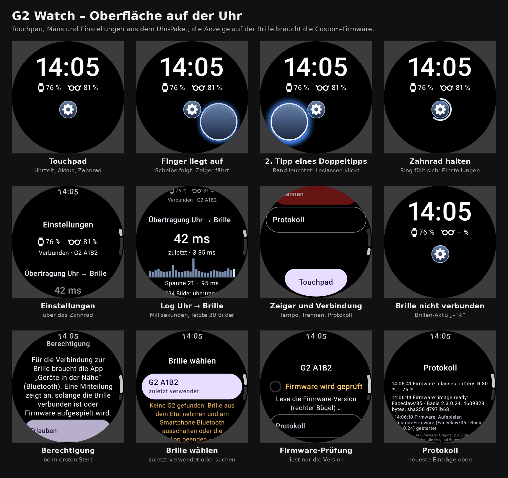

> **Hinweis (G2 Watch 0.2.0):** Diese Dokumente beschreiben das Uhr-Paket *vor* dem Anschluss der
> Firmware. Inzwischen ist der Weg zum Aufspielen eingebaut (`WatchFirmwareInstaller`, siehe
> [`../FIRMWARE.md`](../FIRMWARE.md)), `NoFlashingTest` ist durch `FlashingBoundaryTest` ersetzt und die
> App verlangt genau Faceclaw-Firmware **Revision 35** (Faceclaw 0.8.0) statt „34 oder neuer“.
> Alles zu Maus, Touchpad und Einstellungen gilt weiter.

# G2 Watch – Uhr-Oberfläche, Maus und Einstellungen

Dieses Paket enthält alles, um die Uhr-Oberfläche, die Maus für die Brille und die Einstellungen in einem neuen Chat nachzubauen oder in ein anderes Projekt einzubauen. Stand: 27.09.2026, Branch `claude/laughing-dijkstra-aes5wg` von `MADTreasures/ER-G2_own_firmware`.

## Was drin ist

| Pfad | Inhalt |
|---|---|
| `docs/EINBAU_MAUS_UND_UHR.md` | **Die Anleitung.** Maus, Touchpad mit Zahnrad und Glasscheibe (alle Maße, Farben, Zeiten), Einstellungen mit Millisekunden-Log, Firmware-Knöpfe und wie der Weg zum Aufspielen angeschlossen wird, Tests, Übergabetext |
| `docs/ARCHITEKTUR.md` | Aufbau der ganzen App, Sicherheit, Bedienung, Bauen und Testen |
| `docs/bilder/` | Alle Bilder der Uhr (`uhr-*.png`) und der Brille (`desktop-*.png`, `zeiger-lupe.png`), dazu die Übersichten `uebersicht-uhr.png` und `uebersicht-brille.png` |
| `app/src/main/java/ch/madtreasures/g2watch/` | Der Code der App. Wichtig für den Einbau: `ui/TouchpadScreen.kt`, `ui/SettingsScreen.kt`, `ui/BatteryRow.kt`, `desktop/Pointer.kt`, `desktop/DesktopController.kt`, `glasses/FirmwareInstaller.kt`, `glasses/GlassesState.kt` |
| `app/src/test/java/ch/madtreasures/g2watch/` | Die Tests, darunter `ui/TouchpadScreenTest.kt`, `ui/SettingsScreenTest.kt`, `desktop/PointerTest.kt`, `desktop/DesktopControllerTest.kt`, `glasses/FirmwareInstallerTest.kt`, `Fakes.kt` |
| `app/build.gradle.kts`, `gradle/libs.versions.toml`, `settings.gradle.kts` | Versionen und Abhängigkeiten (Wear Compose Material 3 1.7.0, Kotlin 2.4.20, AGP 9.4.1, JDK 25) |
| `RECHERCHE_FIRMWARE.md` | Firmware-Recherche mit Risiken und Wegen zurück; darauf verweist die Bestätigungsseite |
| `faceclaw-*/UPSTREAM.md` | Herkunft des Faceclaw-Kerns (Commit `a6291cf`), der nicht im Paket liegt, sondern aus dem Repo oder von Faceclaw kommt |
| `LICENSE` | GPL-3.0, weil die App Faceclaws Code verwendet |

## So benutzt du es im neuen Chat

1. Lade diese ZIP-Datei im neuen Chat hoch, oder gib dem Chat Zugriff auf das Repo.
2. Kopiere diesen Text hinein:

> Baue die Maus für die Brille und die Uhr-Oberfläche mit Einstellungen aus dem Repo `MADTreasures/ER-G2_own_firmware` (Branch `claude/laughing-dijkstra-aes5wg`) in dieses Projekt ein. Lies dort zuerst `docs/EINBAU_MAUS_UND_UHR.md`.
>
> 1. Übernimm unverändert:
>    - `desktop/Pointer.kt`, `desktop/GrayRaster.kt`, `desktop/GlassesDisplay.kt`, `desktop/DesktopController.kt`, `Scheduler.kt`
>    - `glasses/GlassesState.kt`, `glasses/FirmwareInstaller.kt`
>    - `ui/TouchpadScreen.kt`, `ui/SettingsScreen.kt`, `ui/BatteryRow.kt`, dazu aus `ui/Screens.kt` `CenterText` und die Farben
>
>    Den Beispiel-Desktop (`Desktop.kt`, `DesktopRenderer.kt`, `AndroidTextPainter.kt`, `EmojiText.kt`, dazu `assets/fonts/NotoEmoji*`) übernimmst du nur, wenn hier noch kein eigener Inhalt existiert.
> 2. Implementiere `GlassesDisplay` für den Transport dieses Projekts, nach Abschnitt 3 oder 4 der Anleitung.
> 3. Verdrahte `TouchpadScreen`, `SettingsScreen`, `FirmwareConfirmScreen` und `FirmwareProgressScreen` wie in Abschnitt 3, Schritt 4. Die Bügel-Tipps gehen an `click()` und `back()`. Die Übertragungszeiten füllst du wie in Schritt 7.
> 4. Auf der Uhr stehen oben die Uhrzeit (52 sp) und der Akku von Uhr und Brille, weiß; die Brille nur, solange sie verbunden ist oder lädt. Darunter mittig das Zahnrad, das nur bei 900 ms Halten die Einstellungen öffnet.
> 5. Nur solange ein Finger aufliegt, liegt darunter die dunkle Glasscheibe (38 dp) mit blau leuchtendem Rand. Bei der zweiten Berührung eines Doppeltipps leuchtet der Rand hell auf; das Loslassen klickt. Nach dem Loslassen bleibt nichts stehen. Kein Bild der Brille auf der Uhr, nichts Durchsichtiges.
> 6. Die Einstellungen zeigen das Log der Übertragungszeiten (letzte, Durchschnitt, Spanne, Balken der letzten 30 Bilder, Bildzahl). Dazu kommen die Knöpfe „Original-Firmware“ und „Custom-Firmware“ mit Bestätigung durch 2 s Halten, Zeiger-Tempo und Verbindung.
> 7. Schließe den Weg zum Aufspielen hier an: eine eigene Umsetzung von `FirmwareInstaller` (Abschnitt 7). Sie startet nie von selbst und meldet ihren Fortschritt. Kläre vorher Risiken und Wege zurück (`RECHERCHE_FIRMWARE.md`).
> 8. Behalte beim Zeiger die Negativ-Regel (Schwelle 128, pixelweise), das sofortige Nachziehen nach Bildänderungen und den 33-ms-Takt. Baue keine Einstellung „Parallel“ ein; das Tempo bleibt (0,3–4×).
> 9. Übernimm die Tests `PointerTest`, `DesktopControllerTest`, `TouchpadScreenTest`, `SettingsScreenTest`, `FirmwareInstallerTest` und `Fakes.kt` und lass sie grün laufen.
>
> Fertig ist es, wenn diese Tests grün sind. Sie prüfen den negativen Zeiger, das Zahnrad, die Glasscheibe nur bei Berührung, das Aufleuchten beim Klick, das Log und die Bestätigung durch Halten.

## Was du auf den Bildern siehst

- `uhr-touchpad.png`: oben Uhrzeit und Akku von Uhr und Brille, darunter das Zahnrad. Ohne Finger ist sonst nichts zu sehen.
- `uhr-finger-bewegen.png`: Ein Finger liegt auf, darunter sitzt die dunkle Glasscheibe mit blau leuchtendem Rand. Der Finger ist im Test simuliert.
- `uhr-finger-klick.png`: die zweite Berührung eines Doppeltipps. Der Rand leuchtet hell auf, das Loslassen klickt.
- `uhr-zahnrad-halten.png`: Der Finger ruht auf dem Zahnrad, der Ring füllt sich. Nach 0,9 s öffnen sich die Einstellungen.
- `uhr-einstellungen*.png`: die Einstellungen mit dem Log der Übertragungszeiten in ms, den Firmware-Knöpfen, dem Zeiger-Tempo und der Verbindung.
- `uhr-firmware-*.png`: Bestätigen, 2 s Halten, Übertragung, Fertig und „nicht eingerichtet“. Die Versionen darin sind Beispiele.

## Ehrlicher Stand

- **Tests:** 101 Tests der App sind grün; Lint meldet nur die bekannte Warnung zu `allowBackup`.
- **Gegenprobe:** Absichtlich eingebaute Fehler wurden jeweils von den Tests erkannt (Tabelle in der Anleitung, Abschnitt 9).
- **Hardware:** Auf echter Uhr und Brille ist nichts davon getestet.
- **Firmware:** Die Knöpfe sind gebaut, der Weg zum Aufspielen ist in dieser App aber **nicht** angeschlossen. Sie melden „nicht eingerichtet“, bis das Firmware-Projekt seinen `FirmwareInstaller` einsetzt (Anleitung, Abschnitt 7).
- **Vor dem Anschließen:** Risiken und Wege zurück klären (`RECHERCHE_FIRMWARE.md`).
